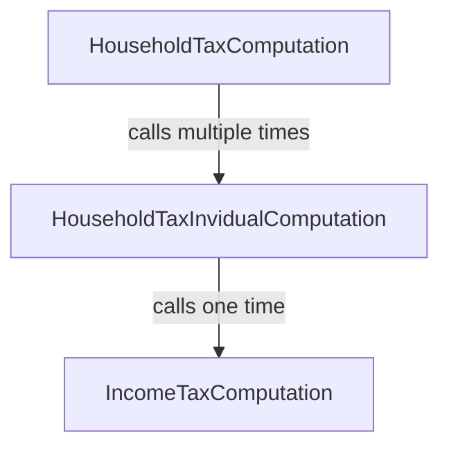

# Going modular with lists

In this section, the tutorial tackles a common pattern that significantly
increases the complexity of a codebase: the need to deal with lists and rules
applying to each element of the list. Here, Catala reuses all the common tricks
and patterns from functional programming to elegantly structure the code while
performing expressive operations on lists.

~~~~~~admonish info collapsible=true title="Recap of the previous section"
This section of the tutorial builds up on the [previous one](./2-2-conditionals-exceptions.md),
and will reuse the same running example, but all the Catala code necessary
to execute the example is included below for reference.

~~~
{{#include ../examples/tutorial_end_2_2.catala_en}}
~~~
~~~~~~

## Making a household from a list of invidivuals

Previously, the Catala Tutorial Tax Code (CTTC) has defined an income tax for
each individual and their children. But now, the CTTC is becoming greedier as a
new, separate tax similar to Thatcher's infamous [poll
tax](https://en.wikipedia.org/wiki/Poll_tax_(Great_Britain)). At its inception,
the household tax is such that each individual in a household is taxed a fixed
sum, with a reduced rate for the children:

~~~admonish quote title="Article 7"
When several individuals live together, they are collectively subject to
the household tax. The household tax owed is $1000 per individual of the household,
and half the amount per children.
~~~

Now, implementing this in Catala requires going beyond the
`IncomeTaxComputation` scope that we used earlier. Indeed, this new tax requires
a new scope, `HouseholdTaxComputation`! While it is fairly evident that the
`output` of this new scope should be the `household_tax`, its `input` is the
collection of individuals that make up the household.

Fortunately, Catala has a built-in type for collection of things, called `list`,
even though it behaves more like an array in traditionnal Computer Science
jargon.

~~~admonish note title="Declaring a new scope with a list input"
```catala
declaration scope HouseholdTaxComputation:
  # The syntax "list of <X>" designates the type whose values are lists of
  # elements with type <X>.
  input individuals content list of Individual
  output household_tax content money
```
~~~

To define `household_tax`, we must now:
1. count the number of individuals in `individuals`;
2. count the number of children in each individual and add these counts together;
3. multiply these counts by the right amount of tax.

We will perform each one of these steps in the body of the `definition` of
`household_tax`, in the scope `HouseholdTaxComputation`, using local
variables.

~~~admonish tip title="`internal` scope variables and local variables in definitions"
When a variable definition gets complex like above, it is often useful to
separate each step by defining intermediate variables. There are two ways
of doing that.

First, you can declare inside the scope declaration an extra scope variable
with the label `internal` instead of `input` or `output`, as seen in
the [first section of the tutorial](./2-1-basic-blocks.md).

Second, if you are confident that you will only need the intermediate variable
in the narrow context of a single scope variable definition, you can use a
local variable inside the definition of the scope variable. These local variables
are introduced and used with the following syntax:

```catala
# The following line defines local variable "x" as begin equal to 4 * 5
let x equals 4 * 5 in
# We can then use "x" after the "in" keyword in the rest of the code
x + 2
```
~~~

For step 1, we simply need to get the lenght of the list `individuals`, which
can be done through the syntax `number of individuals`[^note]. For step 2, we
need to aggregate the number of children for all individuals, which can be done
through the syntax `sum integer of individual.number_of_children for individual
among individuals`. Notice the type indication (`integer`) for the `sum`, which
indicates that if the list of individuals is empty, then the integer `0` should
be returned. Finally, we can piece steps 1 and 2 for the step 3 which computes
the amount of tax:

~~~admonish note title="List lenght and aggregation"
```catala
scope HouseholdTaxComputation:
  definition household_tax equals
    let number_of_individuals equals number of individuals in
    let number_of_children equals
      sum integer
        of individual.number_of_children for individual among individuals
    in
    $1000
    * (
      # "number_of_individuals" is an integer, but money can only be multiplied
      # by decimals: we need to explicitly cast before using the value
      decimal of number_of_individuals
      + decimal of number_of_children / 2.0
    )
```
~~~

This implementation of article 7 is fairly direct and concise. It does the job,
but notice a subtle shift between the text of article 7 and its Catala
implementation: rather than aggregating separately the contribution of each
individual and their children to the household tax, we count all individuals
on one side, and all children on the other side. Addition is commutative
and associative so this shift yields the same result. However, not following
the spirit of the law in the implementation might not be future-proof, as we'll
see just below...

## Refactoring to account for evolving requirements

Translating legal texts into executable code is often an emotional rollercoaster,
as new requirements in later articles may completely break the invariants and
structure of the implementation you used in earlier articles. Today, the
Catala Tutorial Tax Code (CTTC) will be harsh on us, with the following
fateful article:

~~~admonish quote title="Article 8"
The amount of income tax paid by each individual can be deducted from the
share of household tax owed by this individual.
~~~

Quickly, we realize that to be able to deduct correctly the income tax
for each individual, we need to first compute its individual share of the
household tax, which we have not done in the implementation of article  7.
Refactoring is needed!

~~~admonish question title="Is it OK to refactor earlier code when coding a new article?"
Yes it is!

Theoretically, as Catala lets you structure the code by matching the
structure of the legal text, adding new articles should not require changes
in earlier blocks of code. This is the case for instance when a new article
defines an exception to the base case of a variable, as we've experimented in
the [second section of the tutorial](./2-2-conditionals-exceptions.md).

But adding exceptions is not the only things new articles can introduce.
In this case, we see that article 8 makes explicit a computation step
that was implicit or hidden in article 7 (namely, the computation of the
share of household tax for each individual). Making this computation step explicit
implies giving it a first-class status with a Catala concept (a variable,
a scope, etc.), which may not have been the case in the Catala code written before.
Hence, it is normal to refactor earlier code to code up the new article 8.

However, the goal of the refactoring is always to match up as precisely as
possible the computation steps and the articles they are based on.
~~~

Now, there are several strategies to implement article 8, but not all are
legally correct. One strategy could be to compute the total amount of income tax
owed by all the individuals in the household, and substract that total amount of
income tax from the the totam amount of household tax to perform the deduction.
However, this strategy is incorrect, because the household tax deduction for one
individual is implicitly capped by the amount of household tax due for this
individual! This capping introduces a non-linearity in the formula that prevents
rearranging the additions and substractions while keeping the same results in
all configurations.

So, we are stuck with explicitly decomposing the household tax computation
into two steps: first, computing the share of household tax owed by each
individual, and then aggregating the result of the first step for all individuals
of the household. Naturally, the existing scope `HouseholdTaxComputation` is where
the second step will happen. But where to put the first step?

As Catala is a functional programming language, we could define an internal
variable of the scope `HouseholdTaxComputation` that acts as a function to associate
to each individual the share of household tax owed.

~~~admonish note title="Declaring, defining and using a variable that is a function"
The scope declaration could be modified like this:
```catala
declaration scope HouseholdTaxComputation:
  input individuals content list of Individual

  internal share_household_tax content money
    # The following line introduces a parameter to the variable, turning
    # it into a function. "individual" is set as the name of the parameter,
    # a name that is then enforced everywhere in the function definitions.
    # Indeed, lawyers reading Catala code have trouble with function parameters
    # changing names throughout the code.
    depends on individual content Individual
  output household_tax content money
```

Then, the definition of `household_tax` could be done as follows next to article 7:

```catala
scope HouseholdTaxComputation:
  # The definition refers to the function parameter with "of individual"
  definition share_household_tax of individual equals
     1000$ * (1.0 + decimal of individual.number_of_children / 2.0)

  # To aggregate the shares, we call the function "share_household_tax"
  # on all the individuals of the input.
  definition household_tax equals
    sum money share_household_tax of individual
      for individual among individuals
```
~~~

This refactoring works for making explicit the computation step of the
individual share of household tax in article 7, but it is not the most
future-proof strategy. Indeed, as it already happened for article 8, subsequent
articles are likely to introduce refinements and exceptions for this share of
household tax. It is possible to have conditional definitions and exceptions for
variables that are functions, but it is preferable to use a fully-fledged scopes
instead. The scope is more readable by lawyers and has better convenient
features to add input and output parameters, define exceptions for its local
variables, etc.

Hence, we will drop the function variable `share_household_tax` presented above,
and instead opt for creating a brand new scope for computing the share of household
tax owed by an individual, `HouseholdTaxIndividualComputation`.

## The missing scope : household tax computation for the individual

The new scope, `HouseholdTaxIndividualComputation`, will have as input one
individual and return as a result the amount of household tax held. However,
because of article 8, the scope will also need to compute the amount of income
tax owed by the individual, to deduct it from the household tax. The call
graph between scope will then be the following:




Hence, we will also need as input of `HouseholdTaxIndividualComputation` the
inputs necessary for the `IncomeTaxComputation` scope of the [previous section
of the tutorial](./2-2-conditionals-exceptions.md): `overseas_territory` and
`current_date`.

~~~admonish quote title="New scope declarations"
```catala
declaration scope HouseholdTaxComputation:
  input individuals content list of Individual
  input overseas_territories content boolean
  input current_date content date

  output household_tax content money

declaration scope HouseholdTaxIndividualComputation:
  input individual content Individual
  input overseas_territories content boolean
  input current_date content date
  internal deduction content money
  output household_tax content money
```
~~~


## Linking scopes together through list mapping

[^note]:The syntax for all list
operations can be found in [the syntax sheat cheet](https://catalalang.github.io/catala/syntax.pdf)
or in the [language reference](./5-catala.md).
