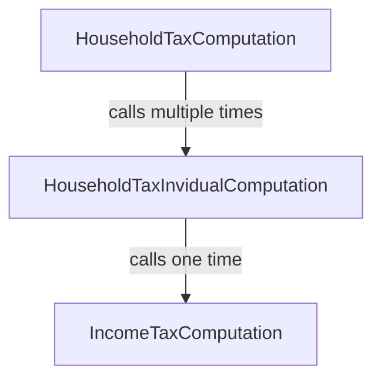

# Going modular with lists

In this section, the tutorial tackles a common pattern that significantly
increases the complexity of a codebase: the need to deal with lists and rules
applying to each element of the list. Here, Catala reuses all the common tricks
and patterns from functional programming to elegantly structure the code while
performing expressive operations on lists.

This section of the tutorial is quite challenging and involves some complexity
in the example. This complexity is necessary to illustrate how the features
of Catala scale to real-world legal texts that involve complex features. We
encourage the reader to persevere in their study of this section, and to
ask any question on the [online Catala community chat](https://zulip.catala-lang.org).

~~~~~~admonish info collapsible=true title="Recap of the previous section"
This section of the tutorial builds up on the [previous one](./2-2-conditionals-exceptions.md),
and will reuse the same running example, but all the Catala code necessary
to execute the example is included below for reference.

~~~
{{#include ../examples/tutorial_end_2_2.catala_en}}
~~~
~~~~~~

## Making a household from a list of invidivuals

Previously, the Catala Tutorial Tax Code (CTTC) has defined an income tax for
each individual and their children. But now, the CTTC is becoming greedier as a
new, separate tax similar to Thatcher's infamous [poll
tax](https://en.wikipedia.org/wiki/Poll_tax_(Great_Britain)). At its inception,
the household tax is such that each individual in a household is taxed a fixed
sum, with a reduced rate for the children:

~~~admonish quote title="Article 7"
When several individuals live together, they are collectively subject to
the household tax. The household tax owed is $10,000 per individual of the household,
and half the amount per children.
~~~

Now, implementing this in Catala requires going beyond the
`IncomeTaxComputation` scope that we used earlier. Indeed, this new tax requires
a new scope, `HouseholdTaxComputation`! While it is fairly evident that the
`output` of this new scope should be the `household_tax`, its `input` is the
collection of individuals that make up the household.

Fortunately, Catala has a built-in type for collection of things, called `list`,
even though it behaves more like an array in traditionnal Computer Science
jargon.

~~~admonish note title="Declaring a new scope with a list input"
```catala
declaration scope HouseholdTaxComputation:
  # The syntax "list of <X>" designates the type whose values are lists of
  # elements with type <X>.
  input individuals content list of Individual
  output household_tax content money
```
~~~

To define `household_tax`, we must now:
1. count the number of individuals in `individuals`;
2. count the number of children in each individual and add these counts together;
3. multiply these counts by the right amount of tax.

We will perform each one of these steps in the body of the `definition` of
`household_tax`, in the scope `HouseholdTaxComputation`, using local
variables.

~~~admonish tip title="`internal` scope variables and local variables in definitions"
When a variable definition gets complex like above, it is often useful to
separate each step by defining intermediate variables. There are two ways
of doing that.

First, you can declare inside the scope declaration an extra scope variable
with the label `internal` instead of `input` or `output`, as seen in
the [first section of the tutorial](./2-1-basic-blocks.md).

Second, if you are confident that you will only need the intermediate variable
in the narrow context of a single scope variable definition, you can use a
local variable inside the definition of the scope variable. These local variables
are introduced and used with the following syntax:

```catala
# The following line defines local variable "x" as begin equal to 4 * 5
let x equals 4 * 5 in
# We can then use "x" after the "in" keyword in the rest of the code
x + 2
```
~~~

For step 1, we simply need to get the lenght of the list `individuals`, which
can be done through the syntax `number of individuals` (the syntax for all list
operations can be found in [the syntax sheat cheet](https://catalalang.github.io/catala/syntax.pdf)
or in the [language reference](./5-catala.md)). For step 2, we
need to aggregate the number of children for all individuals, which can be done
through the syntax `sum integer of individual.number_of_children for individual
among individuals`. Notice the type indication (`integer`) for the `sum`, which
indicates that if the list of individuals is empty, then the integer `0` should
be returned. Finally, we can piece steps 1 and 2 for the step 3 which computes
the amount of tax:

~~~admonish note title="Computing the lenght of a list and aggregating amounts"
```catala
scope HouseholdTaxComputation:
  definition household_tax equals
    let number_of_individuals equals number of individuals in
    let number_of_children equals
      sum integer
        of individual.number_of_children for individual among individuals
    in
    $10,000
    * (
      # "number_of_individuals" is an integer, but money can only be multiplied
      # by decimals: we need to explicitly cast before using the value
      decimal of number_of_individuals
      + decimal of number_of_children / 2.0
    )
```
~~~

This implementation of article 7 is fairly direct and concise. It does the job,
but notice a subtle shift between the text of article 7 and its Catala
implementation: rather than aggregating separately the contribution of each
individual and their children to the household tax, we count all individuals
on one side, and all children on the other side. Addition is commutative
and associative so this shift yields the same result. However, not following
the spirit of the law in the implementation might not be future-proof, as we'll
see just below...

## Refactoring to account for evolving requirements

Translating legal texts into executable code is often an emotional rollercoaster,
as new requirements in later articles may completely break the invariants and
structure of the implementation you used in earlier articles. Today, the
Catala Tutorial Tax Code (CTTC) will be harsh on us, with the following
fateful article:

~~~admonish quote title="Article 8"
The amount of income tax paid by each individual can be deducted from the
share of household tax owed by this individual.
~~~

Quickly, we realize that to be able to deduct correctly the income tax
for each individual, we need to first compute its individual share of the
household tax, which we have not done in the implementation of article  7.
Refactoring is needed!

~~~admonish question title="Is it OK to refactor earlier code when coding a new article?"
Yes it is!

Theoretically, as Catala lets you structure the code by matching the
structure of the legal text, adding new articles should not require changes
in earlier blocks of code. This is the case for instance when a new article
defines an exception to the base case of a variable, as we've experimented in
the [second section of the tutorial](./2-2-conditionals-exceptions.md).

But adding exceptions is not the only things new articles can introduce.
In this case, we see that article 8 makes explicit a computation step
that was implicit or hidden in article 7 (namely, the computation of the
share of household tax for each individual). Making this computation step explicit
implies giving it a first-class status with a Catala concept (a variable,
a scope, etc.), which may not have been the case in the Catala code written before.
Hence, it is normal to refactor earlier code to code up the new article 8.

However, the goal of the refactoring is always to match up as precisely as
possible the computation steps and the articles they are based on.
~~~

Now, there are several strategies to implement article 8, but not all are
legally correct. One strategy could be to compute the total amount of income tax
owed by all the individuals in the household, and substract that total amount of
income tax from the the totam amount of household tax to perform the deduction.
However, this strategy is incorrect, because the household tax deduction for one
individual is implicitly capped by the amount of household tax due for this
individual! This capping introduces a non-linearity in the formula that prevents
rearranging the additions and substractions while keeping the same results in
all configurations.

So, we are stuck with explicitly decomposing the household tax computation
into two steps: first, computing the share of household tax owed by each
individual, and then aggregating the result of the first step for all individuals
of the household. Naturally, the existing scope `HouseholdTaxComputation` is where
the second step will happen. But where to put the first step?

As Catala is a functional programming language, we could define an internal
variable of the scope `HouseholdTaxComputation` that acts as a function to associate
to each individual the share of household tax owed.

~~~admonish note title="Declaring, defining and using a variable that is a function"
The scope declaration could be modified like this:
```catala
declaration scope HouseholdTaxComputation:
  input individuals content list of Individual

  internal share_household_tax content money
    # The following line introduces a parameter to the variable, turning
    # it into a function. "individual" is set as the name of the parameter,
    # a name that is then enforced everywhere in the function definitions.
    # Indeed, lawyers reading Catala code have trouble with function parameters
    # changing names throughout the code.
    depends on individual content Individual
  output household_tax content money
```

Then, the definition of `household_tax` could be done as follows next to article 7:

```catala
scope HouseholdTaxComputation:
  # The definition refers to the function parameter with "of individual"
  definition share_household_tax of individual equals
     $10,000 * (1.0 + decimal of individual.number_of_children / 2.0)

  # To aggregate the shares, we call the function "share_household_tax"
  # on all the individuals of the input.
  definition household_tax equals
    sum money share_household_tax of individual
      for individual among individuals
```
~~~

This refactoring works for making explicit the computation step of the
individual share of household tax in article 7, but it is not the most
future-proof strategy. Indeed, as it already happened for article 8, subsequent
articles are likely to introduce refinements and exceptions for this share of
household tax. It is possible to have conditional definitions and exceptions for
variables that are functions, but it is preferable to use a fully-fledged scopes
instead. The scope is more readable by lawyers and has better convenient
features to add input and output parameters, define exceptions for its local
variables, etc.

Hence, we will drop the function variable `share_household_tax` presented above,
and instead opt for creating a brand new scope for computing the share of household
tax owed by an individual, `HouseholdTaxIndividualComputation`.

## The missing scope : household tax computation for the individual

The new scope, `HouseholdTaxIndividualComputation`, will have as input one
individual and return as a result the amount of household tax held. However,
because of article 8, the scope will also need to compute the amount of income
tax owed by the individual, to deduct it from the household tax. The call
graph between scopes will then be the following:




Hence, we will also need as input of `HouseholdTaxIndividualComputation` the
inputs necessary for the `IncomeTaxComputation` scope of the [previous section
of the tutorial](./2-2-conditionals-exceptions.md): `overseas_territory` and
`current_date` This gives the following scope declaration:

~~~admonish quote title="Initial declaration of `HouseholdTaxIndividualComputation`"
```catala
declaration scope HouseholdTaxIndividualComputation:
  input individual content Individual
  input overseas_territories content boolean
  input current_date content date

  output household_tax content money
```
~~~

Now, we know that we'll need to call `IncomeTaxComputation` exactly one time to
compute the deduction for `household_tax`. There is a bespoke method designed
for lawyer-readbility to do exactly that in Catala!

~~~admonish note title="Declaring a static sub-scope call and defining the sub-scope call's inputs"
```catala
# The single, static sub-scope call to "IncomeTaxComputation" has to be
# declared in "HouseholdTaxIndividualComputation", so we repeat the
# scope declaration here with a new line.
declaration scope HouseholdTaxIndividualComputation:
  input individual content Individual
  input overseas_territories content boolean
  input current_date content date

  # The following line declares a static, single call to the sub-scope
  # "IncomeTaxComputation" with the name "income_tax_computation".
  income_tax_computation scope IncomeTaxComputation

  output household_tax content money

scope HouseholdTaxIndividualComputation:
  # Inside a "scope" block, we have to define the arguments to the sub-scope
  # call "income_tax_computation": "individual", "overseas_territories" and
  # "overseas_territories".
  definition income_tax_computation.individual equals
    individual
  # The "individual" given as an argument to "income_tax_computation",
  # which is the call to "IncomeTaxComputation", is the same "individual"
  # that is the input to "HouseholdTaxIndividualComputation".
  definition income_tax_computation.overseas_territories equals
    overseas_territories
  # These lines can appear totological but they are essential for plugging
  # scopes to sub-scopes in an non-ambiguous way. It is implicit that we evaluate
  # the income tax for deduction at the same date as we evaluate the amount of
  # household tax, but this line makes it explicit. Sometimes, you might want
  # to call the income tax computation at an earlier date (like "current_date
  # - 5 year") because of a legal requirement, and this is where you specify
  # this!
  definition income_tax_computation.current_date equals
    current_date
```

That's it, the sub-scope call has been completely set up! The result
is now accessible at `income_tax_computation.income_tax`, since
"income_tax" is the output variable of the sub-scope `IncomeTaxComputation`.
~~~

At this point, it would be easy to define `household_tax` in a single sweep
inside `HouseholdTaxIndividualComputation`:

```catala
scope HouseholdTaxIndividualComputation:
  definition household_tax equals
    let tax equals
      $10,000 * (1.0 + decimal of individual.number_of_children / 2.0)
    in
    let deduction equals income_tax_computation.income_tax in
    # Don't forget to cap the deduction!
    if deduction > tax then $0 else tax - deduction
```

However, doing so merges together the specifications of article 7 and article 8,
which goes against the spirit of Catala to split the code in the same structure
as the legal text. So, instead of using two local variables inside the definition
of `household_tax`, we want to split the formula into two distinct `definition`.
Intuitively, this implies creating two scope variables in
`HouseholdTaxIndividualComputation`, `household_tax_base` (for article 7) and
`household_tax_with_deduction` (article 8). But really, this amounts to giving
two consecutive states for the variable `household_tax`, and lawyers understand
the code better this way! So Catala has a feature to let you exactly that:

~~~admonish note title="Defining multiple states for the same variable"
```catala
declaration scope HouseholdTaxIndividualComputation:
  input individual content Individual
  input overseas_territories content boolean
  input current_date content date

  income_tax_computation scope IncomeTaxComputation

  output household_tax content money
    # The different states for variable "household_tax" are declared here,
    # in the exact order in which you expect them to be computed!
    state base
    state with_deduction
```

With our two states `base` and `with_deduction`, we can code up articles 7 and
8:

#### Article 7

When several individuals live together, they are collectively subject to
the household tax. The household tax owed is $10,000 per individual of the household,
and half the amount per children.

```catala
scope HouseholdTaxIndividualComputation:
  definition household_tax state base equals
    $10,000 * (1.0 + decimal of individual.number_of_children / 2.0)
```

#### Article 8

The amount of income tax paid by each individual can be deducted from the
share of household tax owed by this individual.

```catala
scope HouseholdTaxIndividualComputation:
  definition household_tax state with_deduction equals
    # Below, "household_tax" refers to the value of "household_tax" computed
    # in the previous state, so here the state "base" which immediately precedes
    # the state "with_deduction" in the declaration.
    if income_tax_computation.income_tax > household_tax then $0
    else
      household_tax - income_tax_computation.income_tax
    # It is also possible to refer to variable states explicitely with the
    # syntax "household_tax state base".
```

Elsewhere in `HouseholdTaxIndividualComputation`, using `household_tax` will
implicitly refer to the last state of the variable (so here `with_deduction`),
matching the usual implicit convention in legal texts.
~~~

This completes our implementation of `HouseholdTaxIndividualComputation`! Its
output variable `household_tax` now contains the share of household tax owed by
each individual of the household, with the correct income tax deduction.
We can now use it in the computation of the global household tax in
`HouseholdTaxComputation`.

## Linking scopes together through list mapping

We can now finish coding up article 7 by adding together each share of the
household tax owzed by all the individuals of the household. We will do
that through list aggregation, as previously, but the elements of the list to
aggregate are now the result of calling `HouseholdTaxIndividualComputation`
on each individual. Previously, we have showed how to call a sub-scope
statically and exactly one time. But here, this is not what we want: we want
to call the sub-scope as many times as there are individuals in the household.
We then have to use a different method for calling the sub-scope:

~~~admonish note title="Calling a sub-scope dynamically"
With all our refactorings, the declaration of the scope `HouseholdTaxComputation`
can be simplified (we don't need the function variable `share_household_tax`
anymore):

```catala
declaration scope HouseholdTaxComputation:
  input individuals content list of Individual
  output household_tax content money
```

Then, the definition of `household_tax` could be re-written as follows next
to article 7:

```catala
scope HouseholdTaxComputation:
  definition household_tax equals
    sum money
      of (
      (
        # Below is the syntax for calling the sub-scope
        # "HouseholdTaxIndividualComputation" dynamically, on the spot.
        # after "with" is the list of inputs of the scope.
        output of HouseholdTaxIndividualComputation with {
          # The next three lines are tautological in this example, because
          # the names of the parameters and the names of the scope variables
          # are identical, but the values of the scope call parameters can be
          # arbitrarily complex!
          -- individual: individual # <- this last "invididual" is the map variable
          -- overseas_territories: overseas_territories
          -- current_date: current_date
        }
      # The construction "output of <X> with { ... }" returns a structure
      # containing all the output variables of scope <X>. Hence, we access
      # output variable "household_tax" of scope
      # "HouseholdTaxIndividualComputation" with the field access syntax
      # ".household_tax".
      ).household_tax
    )
      for individual among individuals
```
~~~

That's it! We've finished implementing article 7 and article 8 in a clean,
extensible, future-proof fashion using a series of scopes that call
each other. As an exercise, you can try implementing a new article that
complexifies even more the computation:

~~~admonish quote title="Article 9"
The deduction granted at article 8 is capped at $8,500 for the whole household.
~~~

~~~admonish example title="Implementation solution for articles 7, 8 and 9" collapsible=true
```catala
declaration scope HouseholdTaxComputation:
  input individuals content list of Individual
  input overseas_territories content boolean
  input current_date content date

  internal shares_of_household_tax
    # It is possible to store the structure resulting from a scope call
    # (with all its output variable) into a single type. The name of this
    # structure type is the name of the scope, hence the line below.
    content list of HouseholdTaxIndividualComputation
  internal total_deduction content money
    state base
    state capped

  output household_tax content money
    state base
    state deduction

declaration scope HouseholdTaxIndividualComputation:
  input individual content Individual
  input overseas_territories content boolean
  input current_date content date

  income_tax_computation scope IncomeTaxComputation

  output household_tax content money
  output deduction content money
```

#### Article 7

When several individuals live together, they are collectively subject to
the household tax. The household tax owed is $10,000 per individual of the household,
and half the amount per children.


```catala
scope HouseholdTaxIndividualComputation:
  definition household_tax equals
    $10,000 * (1.0 + decimal of individual.number_of_children / 2.0)

scope HouseholdTaxComputation:
  definition shares_of_household_tax equals
    (
      output of HouseholdTaxIndividualComputation with {
        -- individual: individual
        -- overseas_territories: overseas_territories
        -- current_date: current_date
      }
    )
      for individual among individuals

  definition household_tax
    state base
  equals
    sum money
      of share_of_household_tax.household_tax
      for share_of_household_tax among shares_of_household_tax
```

#### Article 8

The amount of income tax paid by each individual can be deducted from the
share of household tax owed by this individual.

```catala
scope HouseholdTaxIndividualComputation:
  definition income_tax_computation.individual equals
    individual
  definition income_tax_computation.overseas_territories equals
    overseas_territories
  definition income_tax_computation.current_date equals
    current_date

  definition deduction equals
    if income_tax_computation.income_tax > household_tax then household_tax
    else income_tax_computation.income_tax

scope HouseholdTaxComputation:
  definition total_deduction
    state base
  equals
    sum money
      of share_of_household_tax.deduction
      for share_of_household_tax among shares_of_household_tax

  definition household_tax
    state deduction
  equals
    if total_deduction > household_tax then $0
    else household_tax - total_deduction
```

#### Article 9

The deduction granted at article 8 is capped at $8,500 for the whole household.

```catala
scope HouseholdTaxComputation:
  definition total_deduction
    state capped
  equals
    if total_deduction > $8,500 then $8,500 else total_deduction
```
~~~

## Testing and debugging the computation

We have written quite complex code in this tutorial section, it is high
time to test and debug it. Similarly to the test presented in the
[first tutorial section](./2-1-basic-blocks.md), we can declare a new
test scope for the household tax computation, and execute it:

~~~admonish success title="New test for `HouseholdTaxComputation`"
```catala
declaration scope TestHousehold:
  output computation content HouseholdTaxComputation

scope TestHousehold:
  definition computation equals
    output of HouseholdTaxComputation with {
      -- individuals:
        [ Individual {
            -- income: $15,000
            -- number_of_children: 0
          } ;
          Individual {
            -- income: $80,000
            -- number_of_children: 2
          } ]
      -- overseas_territories: false
      -- current_date: |1999-01-01|
    }
```

```text
catala interpret tutorial.catala_en --scope=TestHousehold
┌─[RESULT]─
│ computation = HouseholdTaxComputation { -- household_tax: $21,500.00 }
└─
```
~~~

Is the result of the test correct ? Let's see by unrolling the computation
manually:
* The household tax for two individuals and two children is `2 * $10,000 + 2 *
  $5,000`, so $30,000;
* The first individual earns more than $10,000, less than $100,000, has no
  children and we are before the year 2000, so the income tax rate is 20 %
  per article 2 and their income tax is $3,000;
* The share of household tax for the first individual is $10,000, so the deduction
  for the first individual is the full $3,000;
* The second individual earns more than $10,000, less than $100,000$, but has
  two children so the income tax rate is 15 % per article 3 and their
  income tax is $12,000;
* The share of household tax for the second individual is $20,000, so the
  deduction for the second individual is the full $12,000$;
* The total deduction is thus $15,000$, which is capped at $8,500 per article 9;
* Applying the deduction to the base household tax yields $21,500.

So far so good, the test result is correct. But it might have gotten to the
right result by taking the wrong intermediate steps, so we'll want to
inspect them. Fortunately, the Catala interpreter can print the full
computation trace for that purpose. Here is the output on the interpretation
of `TestHousehold`:

~~~admonish abstract title="Trace of `TestHousehold`" collapsible=true
```text
$ catala interpret tutorial.catala_en --scope=TestHousehold --trace
[LOG] ☛ Definition applied:
      ─➤ tutorial.catala_en
          │
          │   definition computation equals
          │              ‾‾‾‾‾‾‾‾‾‾‾
      Test
[LOG] →  HouseholdTaxComputation.direct
[LOG]   ≔  HouseholdTaxComputation.direct.
      input: HouseholdTaxComputation_in { -- individuals_in: [Individual { -- income: $15,000.00 -- number_of_children: 0 }; Individual { -- income: $80,000.00 -- number_of_children: 2 }] -- overseas_territories_in: false -- current_date_in: 1999-01-01 }
[LOG]   ☛ Definition applied:
        ─➤ tutorial.catala_en
            │
            │   definition shares_of_household_tax equals
            │              ‾‾‾‾‾‾‾‾‾‾‾‾‾‾‾‾‾‾‾‾‾‾‾
        Article 7
[LOG]   →  HouseholdTaxIndividualComputation.direct
[LOG]     ≔  HouseholdTaxIndividualComputation.direct.
      input: HouseholdTaxIndividualComputation_in { -- individual_in: Individual { -- income: $15,000.00 -- number_of_children: 0 } -- overseas_territories_in: false -- current_date_in: 1999-01-01 }
[LOG]     ☛ Definition applied:
          ─➤ tutorial.catala_en
              │
              │   definition household_tax equals
              │              ‾‾‾‾‾‾‾‾‾‾‾‾‾
          Article 7
[LOG]     ≔  HouseholdTaxIndividualComputation.household_tax: $10,000.00
[LOG]     →  IncomeTaxComputation.direct
[LOG]       ☛ Definition applied:
            ─➤ tutorial.catala_en
                │
                │   definition income_tax_computation.current_date equals
                │              ‾‾‾‾‾‾‾‾‾‾‾‾‾‾‾‾‾‾‾‾‾‾‾‾‾‾‾‾‾‾‾‾‾‾‾
            Article 8
[LOG]       ☛ Definition applied:
            ─➤ tutorial.catala_en
                │
                │   definition income_tax_computation.individual equals
                │              ‾‾‾‾‾‾‾‾‾‾‾‾‾‾‾‾‾‾‾‾‾‾‾‾‾‾‾‾‾‾‾‾‾
            Article 8
[LOG]       ☛ Definition applied:
            ─➤ tutorial.catala_en
                │
                │   definition income_tax_computation.overseas_territories equals
                │              ‾‾‾‾‾‾‾‾‾‾‾‾‾‾‾‾‾‾‾‾‾‾‾‾‾‾‾‾‾‾‾‾‾‾‾‾‾‾‾‾‾‾‾
            Article 8
[LOG]       ≔  IncomeTaxComputation.direct.
      input: IncomeTaxComputation_in { -- current_date_in: 1999-01-01 -- individual_in: Individual { -- income: $15,000.00 -- number_of_children: 0 } -- overseas_territories_in: false }
[LOG]       ☛ Definition applied:
            ─➤ tutorial.catala_en
               │
               │     current_date < |2000-01-01|
               │     ‾‾‾‾‾‾‾‾‾‾‾‾‾‾‾‾‾‾‾‾‾‾‾‾‾‾‾
            Article 2 (old version before 2000)
[LOG]       ≔  IncomeTaxComputation.tax_rate: 0.2
[LOG]       ☛ Definition applied:
            ─➤ tutorial.catala_en
               │
               │   definition income_tax equals
               │              ‾‾‾‾‾‾‾‾‾‾
            Article 1
[LOG]       ≔  IncomeTaxComputation.income_tax: $3,000.00
[LOG]       ☛ Definition applied:
            ─➤ tutorial.catala_en
                │
                │   income_tax_computation scope IncomeTaxComputation
                │   ‾‾‾‾‾‾‾‾‾‾‾‾‾‾‾‾‾‾‾‾‾‾
            Article 7
[LOG]       ≔  IncomeTaxComputation.direct.
      output: IncomeTaxComputation { -- income_tax: $3,000.00 }
[LOG]     ←  IncomeTaxComputation.direct
[LOG]     ≔  HouseholdTaxIndividualComputation.
      income_tax_computation: IncomeTaxComputation { -- income_tax: $3,000.00 }
[LOG]     ☛ Definition applied:
          ─➤ tutorial.catala_en
              │
              │   definition deduction equals
              │              ‾‾‾‾‾‾‾‾‾
          Article 8
[LOG]     ≔  HouseholdTaxIndividualComputation.deduction: $3,000.00
[LOG]     ☛ Definition applied:
          ─➤ tutorial.catala_en
              │
              │       output of HouseholdTaxIndividualComputation with {
              │       ‾‾‾‾‾‾‾‾‾‾‾‾‾‾‾‾‾‾‾‾‾‾‾‾‾‾‾‾‾‾‾‾‾‾‾‾‾‾‾‾‾‾‾‾‾‾‾‾‾‾
              │         -- individual: individual
              │         ‾‾‾‾‾‾‾‾‾‾‾‾‾‾‾‾‾‾‾‾‾‾‾‾‾
              │         -- overseas_territories: overseas_territories
              │         ‾‾‾‾‾‾‾‾‾‾‾‾‾‾‾‾‾‾‾‾‾‾‾‾‾‾‾‾‾‾‾‾‾‾‾‾‾‾‾‾‾‾‾‾‾
              │         -- current_date: current_date
              │         ‾‾‾‾‾‾‾‾‾‾‾‾‾‾‾‾‾‾‾‾‾‾‾‾‾‾‾‾‾
              │       }
              │       ‾
          Article 7
[LOG]     ≔  HouseholdTaxIndividualComputation.direct.
      output: HouseholdTaxIndividualComputation { -- household_tax: $10,000.00 -- deduction: $3,000.00 }
[LOG]   ←  HouseholdTaxIndividualComputation.direct
[LOG]   →  HouseholdTaxIndividualComputation.direct
[LOG]     ≔  HouseholdTaxIndividualComputation.direct.
      input: HouseholdTaxIndividualComputation_in { -- individual_in: Individual { -- income: $80,000.00 -- number_of_children: 2 } -- overseas_territories_in: false -- current_date_in: 1999-01-01 }
[LOG]     ☛ Definition applied:
          ─➤ tutorial.catala_en
              │
              │   definition household_tax equals
              │              ‾‾‾‾‾‾‾‾‾‾‾‾‾
          Article 7
[LOG]     ≔  HouseholdTaxIndividualComputation.household_tax: $20,000.00
[LOG]     →  IncomeTaxComputation.direct
[LOG]       ☛ Definition applied:
            ─➤ tutorial.catala_en
                │
                │   definition income_tax_computation.current_date equals
                │              ‾‾‾‾‾‾‾‾‾‾‾‾‾‾‾‾‾‾‾‾‾‾‾‾‾‾‾‾‾‾‾‾‾‾‾
            Article 8
[LOG]       ☛ Definition applied:
            ─➤ tutorial.catala_en
                │
                │   definition income_tax_computation.individual equals
                │              ‾‾‾‾‾‾‾‾‾‾‾‾‾‾‾‾‾‾‾‾‾‾‾‾‾‾‾‾‾‾‾‾‾
            Article 8
[LOG]       ☛ Definition applied:
            ─➤ tutorial.catala_en
                │
                │   definition income_tax_computation.overseas_territories equals
                │              ‾‾‾‾‾‾‾‾‾‾‾‾‾‾‾‾‾‾‾‾‾‾‾‾‾‾‾‾‾‾‾‾‾‾‾‾‾‾‾‾‾‾‾
            Article 8
[LOG]       ≔  IncomeTaxComputation.direct.
      input: IncomeTaxComputation_in { -- current_date_in: 1999-01-01 -- individual_in: Individual { -- income: $80,000.00 -- number_of_children: 2 } -- overseas_territories_in: false }
[LOG]       ☛ Definition applied:
            ─➤ tutorial.catala_en
               │
               │     individual.number_of_children >= 2
               │     ‾‾‾‾‾‾‾‾‾‾‾‾‾‾‾‾‾‾‾‾‾‾‾‾‾‾‾‾‾‾‾‾‾‾
            Article 3
[LOG]       ≔  IncomeTaxComputation.tax_rate: 0.15
[LOG]       ☛ Definition applied:
            ─➤ tutorial.catala_en
               │
               │   definition income_tax equals
               │              ‾‾‾‾‾‾‾‾‾‾
            Article 1
[LOG]       ≔  IncomeTaxComputation.income_tax: $12,000.00
[LOG]       ☛ Definition applied:
            ─➤ tutorial.catala_en
                │
                │   income_tax_computation scope IncomeTaxComputation
                │   ‾‾‾‾‾‾‾‾‾‾‾‾‾‾‾‾‾‾‾‾‾‾
            Article 7
[LOG]       ≔  IncomeTaxComputation.direct.
      output: IncomeTaxComputation { -- income_tax: $12,000.00 }
[LOG]     ←  IncomeTaxComputation.direct
[LOG]     ≔  HouseholdTaxIndividualComputation.
      income_tax_computation: IncomeTaxComputation { -- income_tax: $12,000.00 }
[LOG]     ☛ Definition applied:
          ─➤ tutorial.catala_en
              │
              │   definition deduction equals
              │              ‾‾‾‾‾‾‾‾‾
          Article 8
[LOG]     ≔  HouseholdTaxIndividualComputation.deduction: $12,000.00
[LOG]     ☛ Definition applied:
          ─➤ tutorial.catala_en
              │
              │       output of HouseholdTaxIndividualComputation with {
              │       ‾‾‾‾‾‾‾‾‾‾‾‾‾‾‾‾‾‾‾‾‾‾‾‾‾‾‾‾‾‾‾‾‾‾‾‾‾‾‾‾‾‾‾‾‾‾‾‾‾‾
              │         -- individual: individual
              │         ‾‾‾‾‾‾‾‾‾‾‾‾‾‾‾‾‾‾‾‾‾‾‾‾‾
              │         -- overseas_territories: overseas_territories
              │         ‾‾‾‾‾‾‾‾‾‾‾‾‾‾‾‾‾‾‾‾‾‾‾‾‾‾‾‾‾‾‾‾‾‾‾‾‾‾‾‾‾‾‾‾‾
              │         -- current_date: current_date
              │         ‾‾‾‾‾‾‾‾‾‾‾‾‾‾‾‾‾‾‾‾‾‾‾‾‾‾‾‾‾
              │       }
              │       ‾
          Article 7
[LOG]     ≔  HouseholdTaxIndividualComputation.direct.
      output: HouseholdTaxIndividualComputation { -- household_tax: $20,000.00 -- deduction: $12,000.00 }
[LOG]   ←  HouseholdTaxIndividualComputation.direct
[LOG]   ≔  HouseholdTaxComputation.
      shares_of_household_tax: [HouseholdTaxIndividualComputation { -- household_tax: $10,000.00 -- deduction: $3,000.00 }; HouseholdTaxIndividualComputation { -- household_tax: $20,000.00 -- deduction: $12,000.00 }]
[LOG]   ☛ Definition applied:
        ─➤ tutorial.catala_en
            │
            │   definition household_tax
            │              ‾‾‾‾‾‾‾‾‾‾‾‾‾
        Article 7
[LOG]   ≔  HouseholdTaxComputation.household_tax#base: $30,000.00
[LOG]   ☛ Definition applied:
        ─➤ tutorial.catala_en
            │
            │   definition total_deduction
            │              ‾‾‾‾‾‾‾‾‾‾‾‾‾‾‾
        Article 8
[LOG]   ≔  HouseholdTaxComputation.total_deduction#base: $15,000.00
[LOG]   ☛ Definition applied:
        ─➤ tutorial.catala_en
            │
            │   definition total_deduction
            │              ‾‾‾‾‾‾‾‾‾‾‾‾‾‾‾
        Article 9
[LOG]   ≔  HouseholdTaxComputation.total_deduction#capped: $8,500.00
[LOG]   ☛ Definition applied:
        ─➤ tutorial.catala_en
            │
            │   definition household_tax
            │              ‾‾‾‾‾‾‾‾‾‾‾‾‾
        Article 8
[LOG]   ≔  HouseholdTaxComputation.household_tax#deduction: $21,500.00
[LOG]   ☛ Definition applied:
        ─➤ tutorial.catala_en
            │
            │     output of HouseholdTaxComputation with {
            │     ‾‾‾‾‾‾‾‾‾‾‾‾‾‾‾‾‾‾‾‾‾‾‾‾‾‾‾‾‾‾‾‾‾‾‾‾‾‾‾‾
            │       -- individuals:
            │       ‾‾‾‾‾‾‾‾‾‾‾‾‾‾‾
            │         [ Individual {
            │         ‾‾‾‾‾‾‾‾‾‾‾‾‾‾
            │             -- income: $15,000
            │             ‾‾‾‾‾‾‾‾‾‾‾‾‾‾‾‾‾‾
            │             -- number_of_children: 0
            │             ‾‾‾‾‾‾‾‾‾‾‾‾‾‾‾‾‾‾‾‾‾‾‾‾
            │           } ;
            │           ‾‾‾
            │           Individual {
            │           ‾‾‾‾‾‾‾‾‾‾‾‾
            │             -- income: $80,000
            │             ‾‾‾‾‾‾‾‾‾‾‾‾‾‾‾‾‾‾
            │             -- number_of_children: 2
            │             ‾‾‾‾‾‾‾‾‾‾‾‾‾‾‾‾‾‾‾‾‾‾‾‾
            │           } ]
            │           ‾‾‾
            │       -- overseas_territories: false
            │       ‾‾‾‾‾‾‾‾‾‾‾‾‾‾‾‾‾‾‾‾‾‾‾‾‾‾‾‾‾‾
            │       -- current_date: |1999-01-01|
            │       ‾‾‾‾‾‾‾‾‾‾‾‾‾‾‾‾‾‾‾‾‾‾‾‾‾‾‾‾‾
            │     }
            │     ‾
        Test
[LOG]   ≔  HouseholdTaxComputation.direct.
      output: HouseholdTaxComputation { -- household_tax: $21,500.00 }
[LOG] ←  HouseholdTaxComputation.direct
[LOG] ≔  TestHousehold.computation: HouseholdTaxComputation { -- household_tax: $21,500.00 }
```
~~~

Inspecting the trace reveals the structure of the computation that matches
closely the legal reasonning we did just above to compute the test output
manually. With this powerful tool, it is possible to debug and maintain
Catala programs at scale.

## Conclusion

Congratulations for finishing the Catala tutorial! This section has not
presented features that are unique to Catala, unlike the exceptions from [the
previous section](./2-2-conditionals-exceptions.md). Rather, in Catala we use
the classic software engineering techniques from functional programming to split
the code into multiple functions that call each other at the right level of
abstraction, with the goal to keep the code close where it is specified in the
law. There are various ways to express something in Catala, but the proximity
between the code and the legal specification should be the proxy for what is the
idiomatic way to do things.

Refactoring the Catala code continuously as new legal requirements are added or
updated is the key to maintaining the codebase efficiently over the long term,
and avoiding the spaghetti code that is common when translating law to code. We
hope this tutorial put you on the right track for your journey into Catala
and the wonderful world of safely and faithfully automating legal provisions.

We encourage you to read the next chapters of this book to continue learning how
to use Catala, as the tutorial is not set in [a real-world software development
projet setup](./3-project), and misses a [lot of tips](./4-0-howto.md) about
coding in Catala but also interacting with lawyers.

~~~~~~admonish info collapsible=true title="Recap of the current section"
For reference, here is the final version of the Catala code consolidated at
the end of this section of the tutorial.

~~~
{{#include ../examples/tutorial_end_2_3.catala_en}}
~~~
~~~~~~
