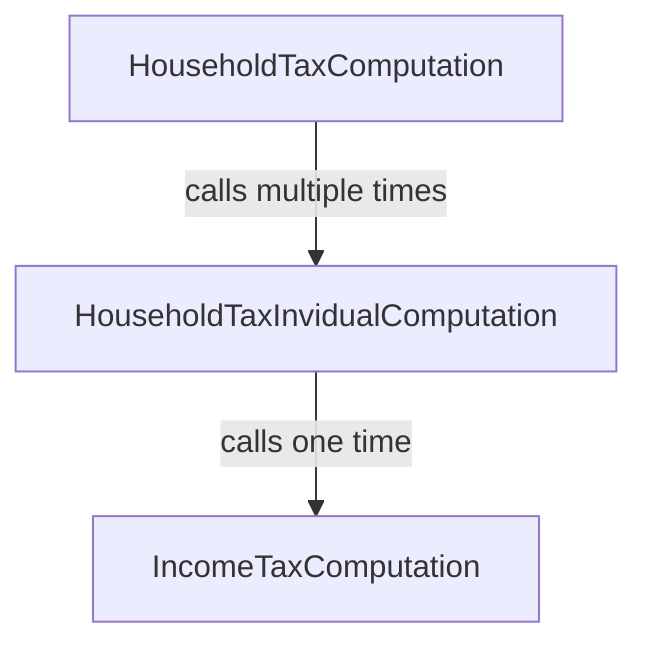

# Lists and scopes

<div id="tocw"></div>

In this section, the tutorial tackles a common pattern that significantly
increases the complexity of a codebase: the need to deal with lists and rules
applying to each element of the list. Here, we learn how to perform operations
with lists and declaring a new scope to deal with rules applying to each element
of the list.

The last two section of the tutorial are quite challenging and involves some
complexity in the example. This complexity is necessary to illustrate how the
features of Catala scale to real-world legal texts that involve complex
features. We encourage the reader to persevere in their study of these sections,
and to ask any question on the [online Catala community
chat](https://zulip.catala-lang.org).

~~~~~~admonish info collapsible=true title="Recap of the previous section"
This section of the tutorial builds up on the [previous one](./2-2-conditionals-exceptions.md),
and will reuse the same running example, but all the Catala code necessary
to execute the example is included below for reference.

~~~
{{#include ../examples/tutorial_end_2_2.catala_en}}
~~~
~~~~~~

## Making a household from a list of invidivuals

Previously, the Catala Tutorial Tax Code (CTTC) has defined an income tax for
each individual and their children. But now, the CTTC is becoming greedier as a
new, separate tax similar to Thatcher's infamous [poll
tax](https://en.wikipedia.org/wiki/Poll_tax_(Great_Britain)). At its inception,
the household tax is such that each individual in a household is taxed a fixed
sum, with a reduced rate for the children:

~~~admonish quote title="Article 7"
When several individuals live together, they are collectively subject to
the household tax. The household tax owed is $10,000 per individual of the household,
and half the amount per children.
~~~

Now, implementing this in Catala requires going beyond the
`IncomeTaxComputation` scope that we used earlier. Indeed, this new tax requires
a new scope, `HouseholdTaxComputation`! While it is fairly evident that the
`output` of this new scope should be the `household_tax`, its `input` is the
collection of individuals that make up the household.

Fortunately, Catala has a built-in type for collection of things, called `list`,
even though it behaves more like an array in traditionnal Computer Science
jargon.

~~~admonish note title="Declaring a new scope with a list input"
```catala
declaration scope HouseholdTaxComputation:
  # The syntax "list of <X>" designates the type whose values are lists of
  # elements with type <X>.
  input individuals content list of Individual
  output household_tax content money
```
~~~

To define `household_tax`, we must now:
1. count the number of individuals in `individuals`;
2. count the number of children in each individual and add these counts together;
3. multiply these counts by the right amount of tax.

We will perform each one of these steps in the body of the `definition` of
`household_tax`, in the scope `HouseholdTaxComputation`, using local
variables.

~~~admonish tip title="`internal` scope variables and local variables in definitions"
When a variable definition gets complex like above, it is often useful to
separate each step by defining intermediate variables. There are two ways
of doing that.

First, you can declare inside the scope declaration an extra scope variable
with the label `internal` instead of `input` or `output`, as seen in
the [first section of the tutorial](./2-1-basic-blocks.md).

Second, if you are confident that you will only need the intermediate variable
in the narrow context of a single scope variable definition, you can use a
local variable inside the definition of the scope variable. These local variables
are introduced and used with the following syntax:

```catala
# The following line defines local variable "x" as begin equal to 4 * 5
let x equals 4 * 5 in
# We can then use "x" after the "in" keyword in the rest of the code
x + 2
```
~~~

For step 1, we simply need to get the length of the list `individuals`, which
can be done through the syntax `number of individuals` (the syntax for all list
operations can be found in [the syntax sheat cheet](https://catalalang.github.io/catala/syntax.pdf)
or in the [language reference](./5-catala.md)). For step 2, we
need to aggregate the number of children for all individuals, which can be done
through the syntax `sum integer of individual.number_of_children for individual
among individuals`. Notice the type indication (`integer`) for the `sum`, which
indicates that if the list of individuals is empty, then the integer `0` should
be returned. Finally, we can piece steps 1 and 2 for the step 3 which computes
the amount of tax:

~~~admonish note title="Computing the length of a list and aggregating amounts"
```catala
scope HouseholdTaxComputation:
  definition household_tax equals
    let number_of_individuals equals number of individuals in
    let number_of_children equals
      sum integer
        of individual.number_of_children for individual among individuals
    in
    $10,000
    * (
      # "number_of_individuals" is an integer, but money can only be multiplied
      # by decimals: we need to explicitly cast before using the value
      decimal of number_of_individuals
      + decimal of number_of_children / 2.0
    )
```
~~~

This implementation of article 7 is fairly direct and concise. It does the job,
but notice a subtle shift between the text of article 7 and its Catala
implementation: rather than aggregating separately the contribution of each
individual and their children to the household tax, we count all individuals
on one side, and all children on the other side. Addition is commutative
and associative so this shift yields the same result. However, not following
the spirit of the law in the implementation might not be future-proof, as we'll
see just below...


~~~admonish success title="Testing the household tax"
To test what happens when the rule for article 7 is at play,
you can test the program with a household:

```catala
declaration scope TestHousehold:
  output computation content HouseholdTaxComputation

scope TestHousehold:
  definition computation equals
    output of HouseholdTaxComputation with {
      -- individuals:
        # The scope expects a list of individuals. In Catala, a list is built
        # with the syntax "[<element 1>; <element 2>; ...]".
        [ Individual {
            -- income: $15,000
            -- number_of_children: 0
          } ;
          Individual {
            -- income: $80,000
            -- number_of_children: 2
          } ]
    }
```

The result of the execution is then:

```test
$ catala interpret tutorial.catala_en --scope=TestHousehold
┌─[RESULT]─
│ computation = HouseholdTaxComputation { -- household_tax: $30,000.00 }
└─
```

We have two individuals and two children so 2 x $10,000 + 2 x $5,000 = $30,000.
~~~

## Refactoring to account for evolving requirements

Translating legal texts into executable code is often an emotional rollercoaster,
as new requirements in later articles may completely break the invariants and
structure of the implementation you used in earlier articles. Today, the
Catala Tutorial Tax Code (CTTC) will be harsh on us, with the following
fateful article:

~~~admonish quote title="Article 8"
The amount of income tax paid by each individual can be deducted from the
share of household tax owed by this individual.
~~~

Now, there are several strategies to implement article 8, but not all are
legally correct. One strategy could be to compute the total amount of income tax
owed by all the individuals in the household, and substract that total amount of
income tax from the the totam amount of household tax to perform the deduction.
However, this strategy is incorrect, because the household tax deduction for one
individual is implicitly capped by the amount of household tax due for this
individual! This capping introduces a non-linearity in the formula that prevents
rearranging the additions and substractions while keeping the same results in
all configurations.

~~~admonish danger title="Watch out for the non-linearity of article 8!"
Suppose you have two individuals, `A` and `B`, with no children, in a household
that is not located in a overseas territory, before the year 2000.

Suppose also that `A`'s income is $20,000, while `B`'s income is $200,000.
According to articles 1 to 6, `A` will pay $20,000 x 20% = $4,000 in income
tax, while `B` will pay $200,000 x 30% = $60,000. So, in total, the household
pays $64,000 of income tax.

On the other hand, the household tax due by this household is
$10,000 + $10,000 = $20,000. How to apply article 8 in this situation?
Naïvely substracting the total income tax ($64,000) from the total household
tax ($20,000) yields a revised household tax of $0, but this is not the legal
amount. Indeed, the deduction can only occur at the individual level.

`A` can deduct $4,000 from their $10,000 share of household tax, so they own
$6,000 in household tax. But `B` can only deduct $10,000 from their $10,000
share of household tax, leaving them with with $0 household tax to pay, but
not -$50,000! This is the non-linearity in action.

So in total, the correct total amount of household tax to pay here is
$6,000 and not $0 as the bulk substraction method computed.
~~~

So, we are stuck with explicitly decomposing the household tax computation into
two steps: first, computing the share of household tax owed by each individual,
and then aggregating the result of the first step for all individuals of the
household. Naturally, the existing scope `HouseholdTaxComputation` is where the
second step will happen. But where to put the first step? Refactoring is needed!

~~~admonish question title="Is it OK to refactor earlier code when coding a new article?"
Yes it is!

Theoretically, as Catala lets you structure the code by matching the
structure of the legal text, adding new articles should not require changes
in earlier blocks of code. This is the case for instance when a new article
defines an exception to the base case of a variable, as we've experimented in
the [second section of the tutorial](./2-2-conditionals-exceptions.md).

But adding exceptions is not the only things new articles can introduce.
In this case, we see that article 8 makes explicit a computation step
that was implicit or hidden in article 7 (namely, the computation of the
share of household tax for each individual). Making this computation step explicit
implies giving it a first-class status with a Catala concept (a variable,
a scope, etc.), which may not have been the case in the Catala code written before.
Hence, it is normal to refactor earlier code to code up the new article 8.

However, the goal of the refactoring is always to match up as precisely as
possible the computation steps and the articles they are based on.
~~~

As it already happened for article 8, subsequent articles are likely to
introduce refinements and exceptions for this share of household tax. In this
case, it is preferable to use a fully-fledged scope to represent this extra
computation step. The scope is readable by lawyers and has better convenient
features to add input and output parameters, define exceptions for its local
variables, etc.

Hence, we will d  opt for creating a brand new scope for computing the share of
household tax owed by an individual, `HouseholdTaxIndividualComputation`.

## The missing scope : household tax computation for the individual

The new scope, `HouseholdTaxIndividualComputation`, will have as input one
individual and return as a result the amount of household tax held. However,
because of article 8, the scope will also need to compute the amount of income
tax owed by the individual, to deduct it from the household tax. The call
graph between scopes will then be the following:




Hence, we will also need as input of `HouseholdTaxIndividualComputation` the
inputs necessary for the `IncomeTaxComputation` scope of the [previous section
of the tutorial](./2-2-conditionals-exceptions.md): `overseas_territory` and
`current_date` This gives the following scope declaration:

~~~admonish quote title="Initial declaration of `HouseholdTaxIndividualComputation`"
```catala
declaration scope HouseholdTaxIndividualComputation:
  input individual content Individual
  input overseas_territories content boolean
  input current_date content date

  output household_tax content money
```
~~~

Now, we know that we'll need to call `IncomeTaxComputation` exactly one time to
compute the deduction for `household_tax`. There is a bespoke method designed
for lawyer-readbility to do exactly that in Catala!

~~~admonish note title="Declaring a static sub-scope call and defining the sub-scope call's inputs"
```catala
# The single, static sub-scope call to "IncomeTaxComputation" has to be
# declared in "HouseholdTaxIndividualComputation", so we repeat the
# scope declaration here with a new line.
declaration scope HouseholdTaxIndividualComputation:
  input individual content Individual
  input overseas_territories content boolean
  input current_date content date

  # The following line declares a static, single call to the sub-scope
  # "IncomeTaxComputation" with the name "income_tax_computation".
  income_tax_computation scope IncomeTaxComputation

  output household_tax content money

scope HouseholdTaxIndividualComputation:
  # Inside a "scope" block, we have to define the arguments to the sub-scope
  # call "income_tax_computation": "individual", "overseas_territories" and
  # "overseas_territories".
  definition income_tax_computation.individual equals
    individual
  # The "individual" given as an argument to "income_tax_computation",
  # which is the call to "IncomeTaxComputation", is the same "individual"
  # that is the input to "HouseholdTaxIndividualComputation".
  definition income_tax_computation.overseas_territories equals
    overseas_territories
  # These lines can appear tautological but they are essential for plugging
  # scopes to sub-scopes in an non-ambiguous way. It is implicit that we evaluate
  # the income tax for deduction at the same date as we evaluate the amount of
  # household tax, but this line makes it explicit. Sometimes, you might want
  # to call the income tax computation at an earlier date (like "current_date
  # - 5 year") because of a legal requirement, and this is where you specify
  # this!
  definition income_tax_computation.current_date equals
    current_date
```

That's it, the sub-scope call has been completely set up! The result
is now accessible at `income_tax_computation.income_tax`, since
"income_tax" is the output variable of the sub-scope `IncomeTaxComputation`.
~~~

At this point, it is be easy to define `household_tax` in a single sweep
inside `HouseholdTaxIndividualComputation`:

```catala
scope HouseholdTaxIndividualComputation:
  definition household_tax equals
    let tax equals
      $10,000 * (1.0 + decimal of individual.number_of_children / 2.0)
    in
    let deduction equals income_tax_computation.income_tax in
    # Don't forget to cap the deduction!
    if deduction > tax then $0 else tax - deduction
```

~~~admonish success title="Testing the individual household tax"
To test what happens when the rule for articles 7 and 8 are at play
you can test the program with an individual:

```catala
declaration scope TestIndividualHousehold:
  output computation content HouseholdTaxIndividualComputation

scope TestIndividualHousehold:
  definition computation equals
    output of HouseholdTaxIndividualComputation with {
      -- individual:
        Individual {
          -- income: $15,000
          -- number_of_children: 0
        }
      -- current_date: |1999-01-01|
      -- overseas_territories: false
    }
```

The result of the execution is then:

```test
$ catala interpret tutorial.catala_en --scope=TestIndividualHousehold
┌─[RESULT]─
│ computation = HouseholdTaxIndividualComputation { -- household_tax: $7,000.00 }
└─
```

The household tax owed by one individual with no children is $10,000, but
we must deduct their income tax. With an income of $15,000, before 2000 and
not in an overseas territory, the income tax rate is 20% according to Article 2,
hence $3,000 of income tax. Therefore, the correct household tax owed with
deduction is $7,000.
~~~

## Conclusion

In this section of the tutorial, we have seen that in Catala, lists of items
are represented as values with their own type like `list of money` or
`list of Individual`. You can manipulate the list values with list operators
like lenght count, aggregation, but also map, filter, map, etc. Please refer
to the [language reference](./5-catala.md) for information about all the
list operators available in Catala. Furthermore, we have also seen in this
section of the tutorial that rather than programming all the rules for dealing
with items in lists inside the list operators, it is preferable to create
a new scope to write all the rules that apply to the items in the list. This has
allowed us to see how scopes can call each other and allow for a modular
codebase that can be refactored to account for evolving legal requirements.

However, right now our implementation of articles 7 and 8 is not complete, as
we're missing the step where `HouseholdTaxComputation` calls
`HouseholdTaxInvidualComputation` on each individual in the household to
complete the household tax computation with the correct deduction. This will be
the topic of the [next and final section of the
tutorial](./2-4-states-dynamic.md).

~~~~~~admonish info collapsible=true title="Recap of the current section"
For reference, here is the final version of the Catala code consolidated at
the end of this section of the tutorial.

~~~
{{#include ../examples/tutorial_end_2_3.catala_en}}
~~~
~~~~~~
