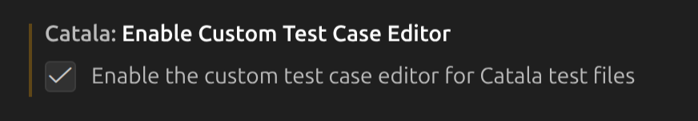

# Test tool (graphical user interface)

In the previous section, you saw how to create and add Catala tests to your
continuous integration system.

Besides this pipeline, we provide a GUI tool to help create domain/business tests. 

In contrast with unit tests that focus on atomic units of implementation, 
domain/business tests aim at testing the output of a whole computation,
or reproduce erroneous computations found in production to catch regressions.
These tests are often written by domain experts who may or may not be developers.

~~~admonish tip
The test editor is packaged in the official Catala
[VS Code extension](https://marketplace.visualstudio.com/items?itemName=catalalang.catala).
~~~

To access this tool, install the VS code extension for Catala, and enable
the test GUI.

## Enabling the test GUI

The GUI tool needs to be enabled before first use. After that, it will stay available.

To do so, bring the VS code command panel (ctrl-shift-P) and search for "settings",
then filter by typing "catala" in the search box.

In the catala settings, check "Enable Custom Test Editor".

## Creating a test

To create a test, create a new source file (ending in `.catala_en`) and
ensure that its name contains "test" (for intance `income_tax_test_42.catala_en`).
You may then right-click on the newly-created file and ...

~~~admonish warning title="Test file names need to contain `test`"
~~~

~~~admonish warning title="Tested scopes **must** be in a module"
Although not all catala code needs to live in a module,
all scopes exercised using the test tool **must** live in a module.
~~~

### Defining input data

### Defining expected values

Asserting on expected values and reporting differences with the
actual computation results is the whole point of a test.

~~~admonish warning title="Be cautious when using the reset feature"
~~~

## Running a test / diff view

~~~admonish tip title="Should I check GUI tests in version control and add them in my continuous integration system?"
Yes! While we provide a GUI for non-programmers to create
business tests whithout writing Catala literals and assertions, good
software engineering practices still apply. We store tests as plain
Catala files (with a few technical attributes) to help check them in
and review diffs in the same manner as other test and program files.
~~~