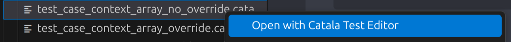
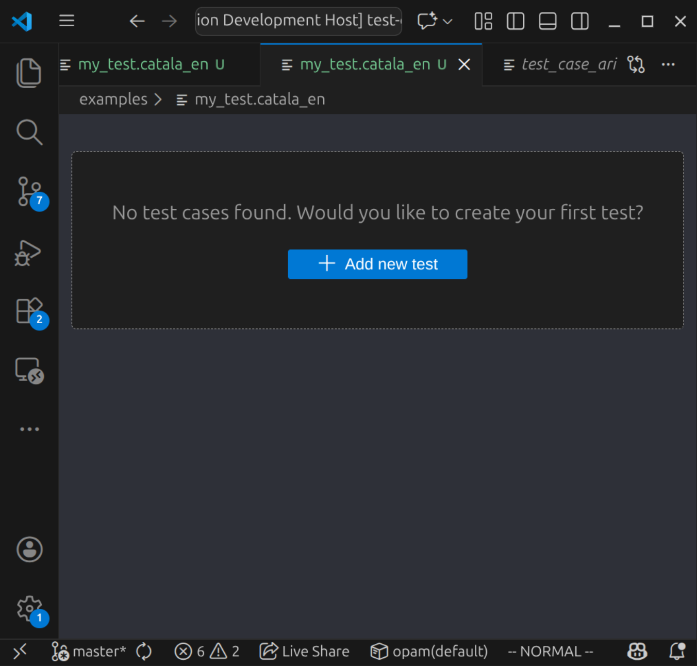
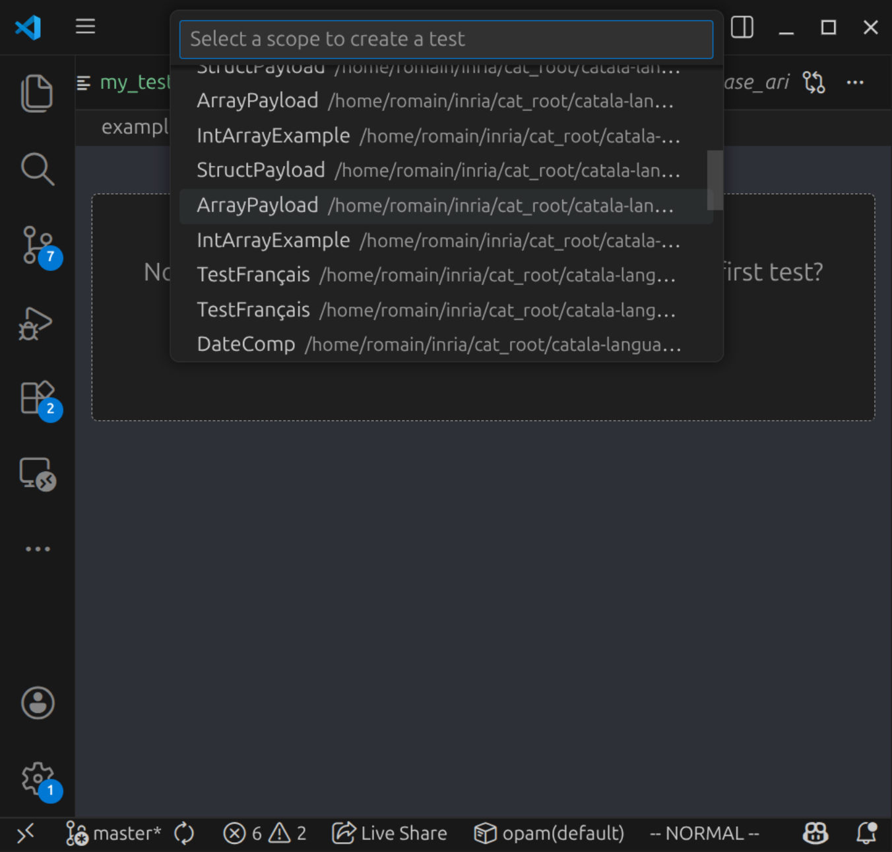
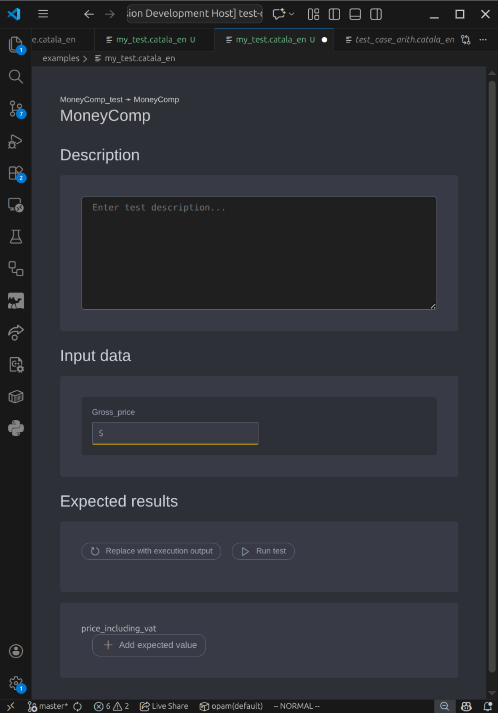
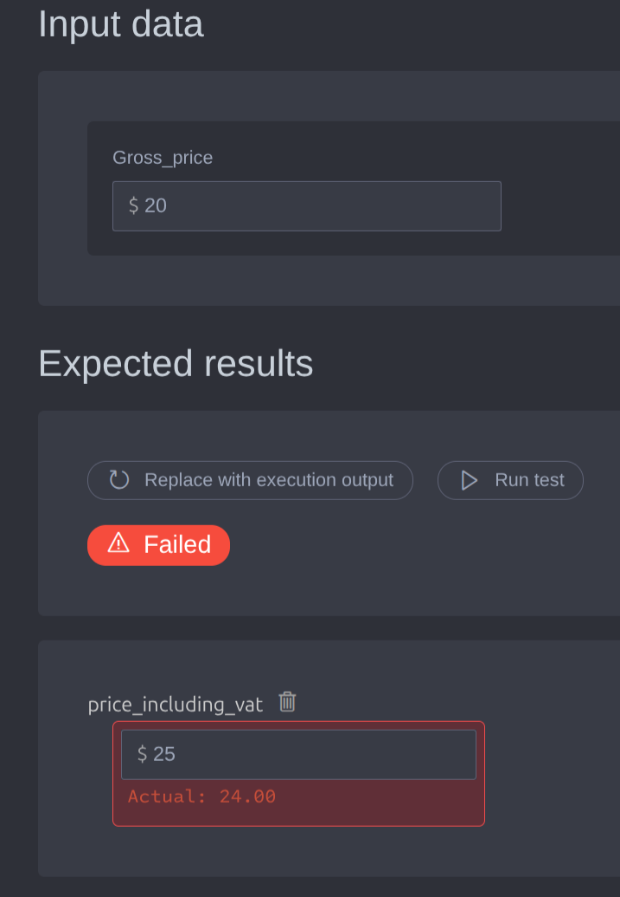
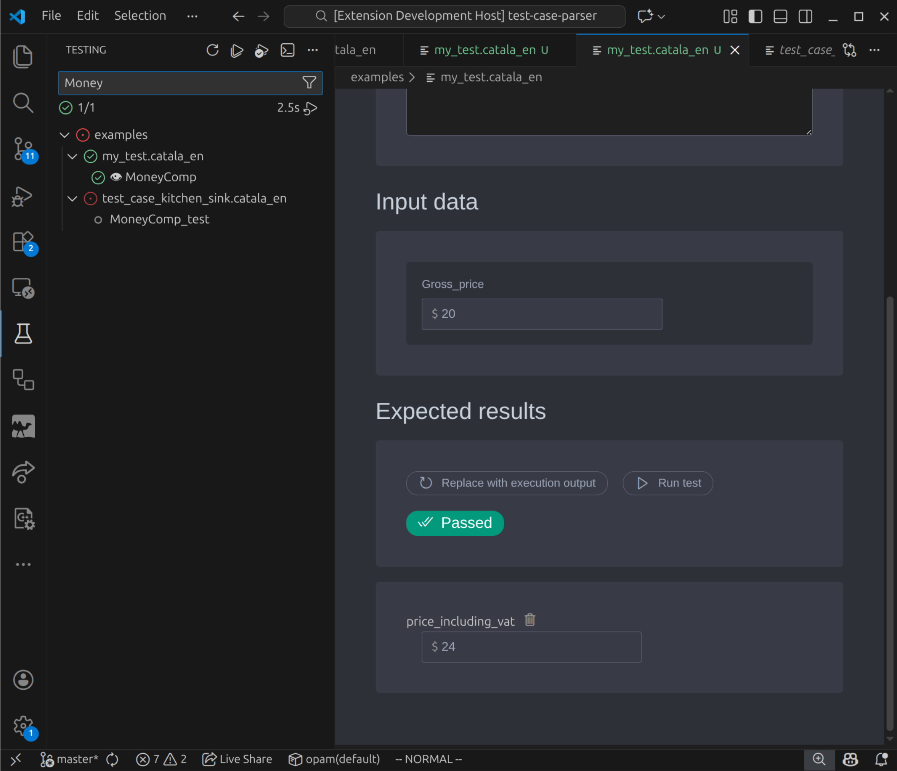
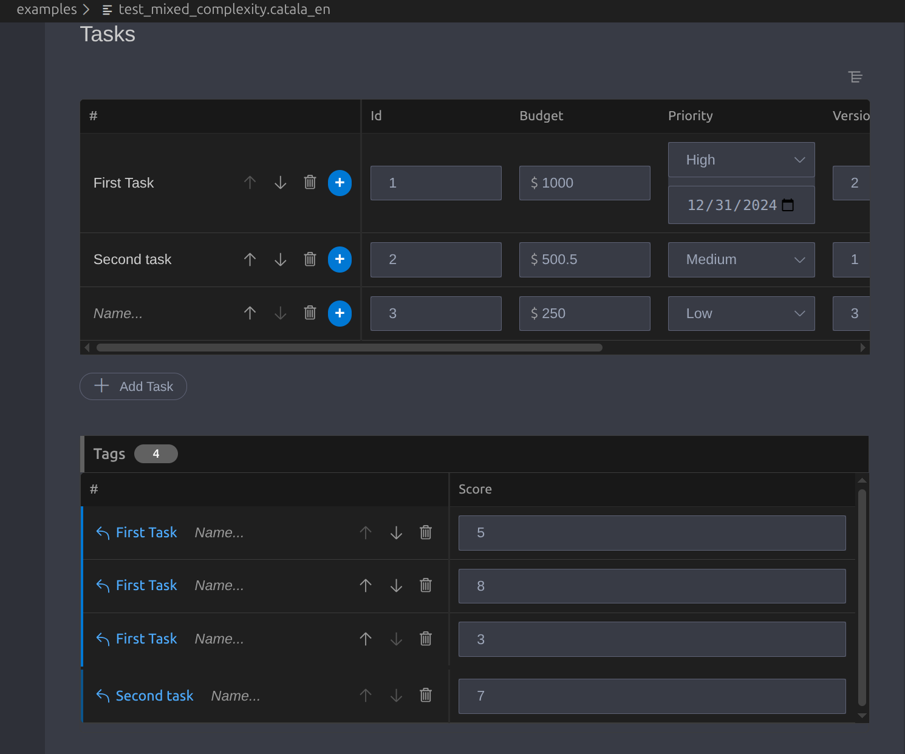

# Test tool (graphical user interface)

In the previous section, you saw how to create and add Catala tests to your
continuous integration system.

In addition, we provide a GUI to help create domain/business tests.

Unlike unit tests which focus on atomic units of implementation,
domain (a.k.a. business) tests aim at testing the output of a whole computation,
or reproduce erroneous computations found in production to catch regressions.
These tests are often written by domain experts who may or may not be developers.

~~~admonish tip
The test editor is packaged in the official Catala
[VS Code extension](https://marketplace.visualstudio.com/items?itemName=catalalang.catala).
~~~

To access this tool, install the VS code extension for Catala, and enable
the test GUI.

## Enabling the test GUI

The GUI tool needs to be enabled before first use.

To do so, bring the VS code command panel (ctrl-shift-P) and search for "settings",
then filter by typing "catala" in the search box.

In the catala settings, check "Enable Custom Test Editor".

## Creating a test

To create a test, create a new source file (ending in `.catala_en`) and
ensure that its name contains "test" (for example `income_tax_test_42.catala_en`).
Right-click on the newly-created file and select
"Open with Catala Test Editor".

~~~admonish warning title="Test file names must contain `test`"
To avoid VS Code needing to peek into file contents before deciding which
plugin(s) may open them, the test case
plugin is restricted to opening Catala files containing `test`
within their name. Other files will trigger the text editor. 
~~~

Opening this new test in the Test Editor will show a welcome
page that lets you create a new test. 

### Select a scope

Available scopes within the project are auto-detected and listed within a dialog.

Select the one that you wish to test, and an input form will
be displayed.

~~~admonish warning title="Tested scopes **must** be defined within a module"
Although not all catala code needs to live in a module,
all scopes exercised using the test tool **must** be defined
within a module.
~~~

### Define input data and expected values

Asserting on expected values and reporting differences with the
actual computation results is the whole point of a test.

The Expected results section of the editor lets you
define those.

## Running a test / diff view

Run a test using the "Run test" button, or directly through the test runner
in VS code. GUI tests are full-blown catala tests, and can (in fact, should!) also be run
using `clerk run` and be part of the test suite exercised by `clerk test`.

When a test fails, the GUI will attempt to show a structural diff, including
missing or extra array elements.

## Managing a business test codebase

~~~admonish tip title="Should I check GUI tests in version control and run them in my continuous integration system?"
**Yes!** While we provide a GUI for non-programmers to create
business tests whithout writing Catala literals and assertions, good
software engineering practices still apply. We store tests as plain
Catala files (with a few technical attributes) to help check them in
and review diffs in the same manner as other test and program files.
~~~

### Searching for tests

GUI tests are registered as native tests in the VS code test view (beaker icon in the main menu)
and can be searched by name or target scope.

### Metadata

When testing deeply nested data, it is often desirable to name test elements
for reference. This can be done in the Array editor.

When named item have sub-items, those will reference their parent's name
for quick navigation.

A test description and title can also be provided.
