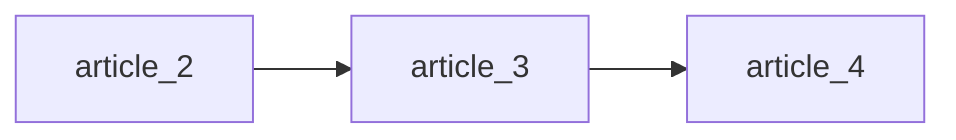
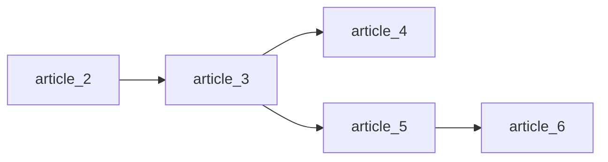
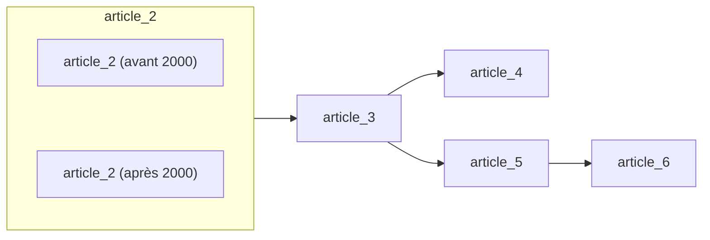

# Définitions conditionnelles et exceptions

<div id="tocw"></div>

Dans cette section, le tutoriel présente la fonctionnalité phare de Catala
pour coder la loi : les exceptions dans les définitions de variables.
À la fin de la section, vous devriez comprendre le comportement des calculs
impliquant des exceptions, et être capable de structurer des groupes de définitions
de variables selon leur statut exceptionnel et leur priorité relative.

~~~~~~admonish info collapsible=true title="Récapitulatif de la section précédente"
Cette section du tutoriel s'appuie sur la [précédente](./2-1-blocs-de-base.md),
et réutilisera le même exemple fil rouge, mais tout le code Catala nécessaire
pour exécuter l'exemple est inclus ci-dessous pour référence.

~~~catala-fr
{{#include ../../examples/tutoriel_fin_2_1.catala_fr}}
~~~
~~~~~~

## Définitions conditionnelles et exceptions

Les spécifications provenant de textes juridiques ne divisent pas toujours
proprement chaque définition de variable dans son propre article. Parfois, et c'est
un schéma très courant, un article ultérieur redéfinit une variable déjà
définie précédemment, mais avec une particularité dans une certaine situation exceptionnelle.
Par exemple, l'article 3 du CITC :

~~~admonish quote title="Article 3"
Si l'individu a la charge de 2 enfants ou plus, alors le pourcentage fixe
mentionné à l'article 1 est égal à 15 %.
~~~

Cet article donne en fait une autre définition pour le pourcentage fixe, qui
était déjà défini à l'article 2. Cependant, l'article 3 définit le pourcentage
conditionnellement au fait que l'individu ait plus de 2 enfants. Comment redéfinir
`taux_imposition` ? Catala vous permet précisément de redéfinir une variable sous une
condition avec la syntaxe `sous condition ... conséquence` entre le nom
de la variable définie et le mot-clé `égal à` :

~~~admonish note title="Définir une variable conditionnellement"
```catala-code-fr
champ d'application CalculImpôtRevenu:
  définition taux_imposition
  sous condition individu.nombre_enfants >= 2
  conséquence égal à 15 %
```
~~~

Qu'est-ce que cela signifie ? Si l'individu a plus de deux enfants, alors
`taux_imposition` sera de `15 %`. Les définitions conditionnelles vous permettent de définir
vos variables par morceaux, un cas à la fois ; le compilateur Catala assemble
le tout pour l'exécution. Plus précisément, à l'exécution, nous regardons
les conditions de toutes les définitions par morceaux pour une même variable, et choisissons
celle qui est valide.


~~~admonish success title="Tester le programme avec trois enfants"
Pour tester ce qui se passe lorsque les règles des articles 2 et 3 sont en jeu,
vous pouvez tester le programme lorsqu'il y a trois enfants, en modifiant le
champ d'application `Test` comme suit :

```catala-code-fr
champ d'application Test:
  définition calcul égal à
    résultat de CalculImpôtRevenu avec {
      -- individu:
        Individu {
          -- revenu: 20 000 €
          -- nombre_enfants: 3
        }
    }
```
~~~

~~~admonish warning title="Conflit entre définitions"
Pendant le test ci-dessus, deux définitions pour `taux_imposition` sont valides en
même temps. Que se passe-t-il alors ? Dans ces cas, Catala interrompra
l'exécution et renverra un message d'erreur comme celui ci-dessous :

```console
$ clerk run tutoriel.catala_fr --scope=Test
┌─[ERROR]─
│
│  During evaluation: conflict between multiple valid consequences for assigning the same variable.
│
├─➤ tutoriel_fr.catala_fr
│     │
│     │   définition taux_imposition égal à 20 %
│     │                              ‾‾‾‾‾‾
├─ Article 2
│
├─➤ tutoriel_fr.catala_fr
│     │
│     │   conséquence égal à 15 %
│     │                      ‾‾‾‾
└─ Article 3
```
~~~

Si la spécification est correctement rédigée, alors ces situations d'erreur ne devraient
pas se produire, car une et une seule définition conditionnelle devrait être valide à tout
moment. Ici, cependant, notre définition de `taux_imposition` entre en conflit avec la
définition plus générale que nous avons donnée ci-dessus. Pour modéliser correctement des situations comme
celle-ci, Catala nous permet de définir la priorité d'une définition conditionnelle
sur une autre. C'est aussi simple que d'ajouter `exception` avant la définition.
Par exemple, voici une version plus correcte du code pour l'article 3 :

~~~admonish quote title="Article 3"
Si l'individu a la charge de 2 enfants ou plus, alors le pourcentage fixe
mentionné à l'article 1 est égal à 15 %.
~~~

~~~admonish note title="Définir une exception pour une variable"
```catala-code-fr
champ d'application CalculImpôtRevenu:
  exception définition taux_imposition
  sous condition individu.nombre_enfants >= 2
  conséquence égal à 15 %
```
~~~

Avec `exception`, la définition conditionnelle de l'article 3 sera choisie par rapport
au cas de base de l'article 1 lorsque l'individu a deux enfants ou plus. Ce
mécanisme d'`exception` est calqué sur la logique de la rédaction juridique : c'est le mécanisme clé
qui nous permet de diviser notre définition de variables pour correspondre à la structure de
la spécification. Sans `exception`, il n'est pas possible d'utiliser le style de
programmation littéraire. C'est précisément pourquoi écrire et maintenir des programmes
informatiques pour les impôts ou les prestations sociales est très difficile avec les langages de programmation
grand public. Alors, allez-y et utilisez `exception` autant que possible,
car c'est un concept Catala très idiomatique.

~~~admonish question title="Comment les exceptions sont-elles calculées ?"
Lors de la définition d'exceptions dans votre code Catala, il est important de comprendre
précisément leur *sémantique* sous-jacente, *c'est-à-dire* quel sera le résultat final
du calcul. La sémantique de Catala est [formellement définie](https://dl.acm.org/doi/10.1145/3473582)
et basée sur la [logique par défaut priorisée](https://link.springer.com/content/pdf/10.1007/978-94-015-9383-0_3?pdf=chapter%20toc),
ce qui se traduit intuitivement par l'algorithme suivant décrivant comment calculer les exceptions :

1. Rassembler toutes les définitions (conditionnelles ou non) pour une variable donnée ;
2. Parmi ces définitions, vérifier toutes celles qui s'appliquent (dont les conditions s'évaluent à `vrai`) :
    - Si aucune définition ne s'applique, le programme plante avec une erreur ("aucune définition ne s'applique") ;
    - Si une seule définition s'applique, alors la choisir et continuer l'exécution du programme ;
    - Si plusieurs définitions s'appliquent, alors vérifier leurs priorités :
        * S'il existe une définition qui est une exception à toutes les
          autres qui s'appliquent, la choisir et continuer l'exécution du programme ;
        * Sinon, le programme plante avec une erreur ("définitions conflictuelles").
~~~

Comme décrit ci-dessus, mettre `exception` dans un programme Catala modifie le comportement
du programme, en fournissant une priorité entre les définitions conditionnelles d'une
variable que Catala peut utiliser au moment de l'exécution lorsqu'il hésite entre plusieurs
définitions qui s'appliquent en même temps. Jusqu'à présent, nous avons vu une situation très simple
avec une définition de base (à l'article 2) et une seule exception (à
l'article 3). Mais le mécanisme d'`exception` peut être beaucoup plus large et aider à définir
différentes lignes de priorité parmi des dizaines de définitions conditionnelles différentes pour une
même variable. Explorons ce mécanisme sur un exemple plus complexe.

## Gérer plusieurs exceptions

Il est fréquent dans les textes juridiques qu'un article établissant une règle générale soit
suivi de plusieurs articles définissant des exceptions à la règle de base. En plus
de l'article 3 et du taux d'imposition réduit pour les familles nombreuses, le CITC (Code des Impôts du Tutoriel Catala)
définit en effet une exonération fiscale pour les individus à faible revenu,
que nous pouvons coder comme une autre exception à la définition du taux d'imposition de
l'article 2 :


~~~admonish quote title="Article 4"
Les individus gagnant moins de 10 000 € sont exonérés de l'impôt sur le revenu mentionné
à l'article 1.

```catala-code-fr
champ d'application CalculImpôtRevenu:
  exception définition taux_imposition
  sous condition individu.revenu <= 10 000 €
  conséquence égal à 0 %
```
~~~

Mais alors, que se passe-t-il lors du test du code avec un individu qui gagne
moins de 10 000 € et a plus de 2 enfants ?


~~~admonish success title="Tester le programme avec trois enfants et un faible revenu"
Pour tester ce qui se passe lorsque les règles des articles 3 et 4 sont en jeu,
vous pouvez tester le programme lorsqu'il y a trois enfants, et un revenu
inférieur à 10 000 € en modifiant le champ d'application `Test` comme suit :

```catala-code-fr
champ d'application Test:
  définition calcul égal à
    résultat de CalculImpôtRevenu avec {
      -- individu:
        Individu {
          -- revenu: 5 000 €
          -- nombre_enfants: 3
        }
    }
```
~~~

~~~admonish bug title="Définitions conflictuelles"
L'exécution du programme produit l'erreur suivante à l'exécution :

```console
$ clerk run tutoriel.catala_fr --scope=Test
┌─[ERROR]─
│
│  During evaluation: conflict between multiple valid consequences for assigning the same variable.
│
├─➤ tutoriel_fr.catala_fr
│     │
│     │   conséquence égal à 15 %
│     │                      ‾‾‾‾
├─ Article 3
│
├─➤ tutoriel_fr.catala_fr
│     │
│     │   conséquence égal à 0 %
│     │                      ‾‾‾
└─ Article 4
```

Dans cette situation, les deux définitions conditionnelles de l'article 3 et de l'article 4
s'appliquent, mais aussi la définition de base de l'article 2. Nous savons que l'article 3 et l'article
4 sont des exceptions à l'article 2, donc ils ont tous deux priorité sur lui. Mais
nous ne savons pas quelle définition a la priorité entre l'article 3 et l'article 4,
d'où le message d'erreur ci-dessus !
~~~

Dans cette situation, nous devons prioriser les exceptions entre elles.


~~~admonish warning title="Prioriser les exceptions est un acte juridique d'interprétation"
La priorisation des exceptions nécessite une expertise et une recherche juridiques, car il
n'est pas toujours évident de savoir quelle exception doit prévaloir dans une situation donnée.
Ainsi, les messages d'erreur Catala indiquant un conflit lors de l'évaluation sont une
invitation à appeler le juriste de votre équipe et à lui faire interpréter la
spécification, plutôt que de résoudre le conflit vous-même.
~~~

Ici, parce que l'article 4 suit l'article 3, et parce qu'il est plus favorable au
contribuable de payer 0 € d'impôt plutôt que 15 % de son revenu, nous pouvons prendre la
décision juridique de prioriser l'exception de l'article 4 sur l'exception de
l'article 3. Maintenant, voyons comment écrire cela avec Catala. Parce que l'article 2 est
le cas de base pour l'exception de l'article 3, et l'article 3 est le cas de base pour
l'exception de l'article 4, nous devons donner aux définitions de `taux_imposition` aux
articles 2 et 3 une `étiquette` explicite afin que les mots-clés `exception` dans les articles
3 et 4 puissent faire référence à ces étiquettes :

~~~admonish note title="Pointer les exceptions vers des étiquettes spécifiques"
#### Article 2

Le pourcentage fixe mentionné à l'article 1 est égal à 20 %.

```catala-code-fr
champ d'application CalculImpôtRevenu:
  # Le mot-clé "étiquette" introduit le nom de l'étiquette elle-même, ici
  # "article_2".
  étiquette article_2 définition taux_imposition égal à 20 %
```

#### Article 3

Si l'individu a la charge de 2 enfants ou plus, alors le pourcentage fixe
mentionné à l'article 1 est égal à 15 %.

```catala-code-fr
champ d'application CalculImpôtRevenu:
  # Cette définition est précédée de deux indications :
  # * elle a sa propre étiquette, "article_3" ;
  # * cette définition est une exception à la définition étiquetée "article_2".
  étiquette article_3 exception article_2
  définition taux_imposition
  sous condition individu.nombre_enfants >= 2
  conséquence égal à 15 %
```

#### Article 4

Les individus gagnant moins de 10 000 € sont exonérés de l'impôt sur le revenu mentionné
à l'article 1.

```catala-code-fr
champ d'application CalculImpôtRevenu:
  étiquette article_4 exception article_3
  définition taux_imposition
  sous condition individu.revenu <= 10 000 €
  conséquence égal à 0 %
```
~~~

Grâce aux étiquettes, nous pouvons définir des *chaînes* d'exceptions, où chaque définition est
l'exception à la précédente, et le cas de base pour la suivante. Ce
modèle est le plus courant dans les textes juridiques, et son comportement est simple :
lorsque plusieurs définitions s'appliquent, choisir celle avec la priorité la plus élevée dans
la chaîne. Voici une représentation de la chaîne d'exceptions dans notre exemple jusqu'à présent :



Mais parfois, il n'est pas possible d'organiser les exceptions en chaîne,
car l'interprétation juridique conduit à différentes *branches* d'exceptions.

## Branches d'exceptions

Il peut être difficile de voir pourquoi certaines situations juridiques peuvent conduire à différentes
branches d'exceptions. Donnons un exemple avec un nouvel article du CITC :

~~~admonish quote title="Article 5"
Les individus gagnant plus de 100 000 € sont soumis à un taux d'imposition de
30%, quel que soit leur nombre d'enfants.

```catala-code-fr
champ d'application CalculImpôtRevenu:
  étiquette article_5 exception article_3
  définition taux_imposition
  sous condition individu.revenu > 100 000 €
  conséquence égal à 30 %
```
~~~

Maintenant, l'article 3 a deux exceptions : l'article 4 et l'article 5. Ces deux exceptions ont les conditions suivantes :
* **Article 4** : revenu inférieur à 10 000 € ;
* **Article 5** : revenu supérieur à 100 000 €.

~~~admonish tip title="Afficher les branches d'exception" collapsible=true
À mesure que la base de code grandit, il devient de plus en plus difficile de visualiser toutes
les définitions conditionnelles d'une variable ainsi que la priorisation entre
elles. Pour aider, le compilateur Catala peut afficher les branches d'exception avec
la commande suivante :

```console
$ catala exceptions tutoriel.catala_fr --scope=CalculImpôtRevenu --variable=taux_imposition
┌[RESULT]─
│ Printing the tree of exceptions for the definitions of variable "taux_imposition" of scope "CalculImpôtRevenu".
└─
┌─[RESULT]─
│ Definitions with label "article_2":
│
├─➤ tutoriel.catala_fr
│    │
│    │   étiquette article_2 définition taux_imposition égal à 20 %
│    │   ‾‾‾‾‾‾‾‾‾‾‾‾‾‾‾‾‾‾‾‾‾‾‾‾‾‾‾‾‾‾‾‾‾‾‾
└─ Title
   └─ Article 2
┌─[RESULT]─
│ Definitions with label "article_3":
│
├─➤ tutoriel.catala_fr
│    │
│    │   étiquette article_3 exception article_2 définition taux_imposition sous condition
│    │   ‾‾‾‾‾‾‾‾‾‾‾‾‾‾‾‾‾‾‾‾‾‾‾‾‾‾‾‾‾‾‾‾‾‾‾‾‾‾‾‾‾‾‾‾‾‾‾‾‾‾‾‾‾‾‾
└─ Title
   └─ Article 3
┌─[RESULT]─
│ Definitions with label "article_4":
│
├─➤ tutoriel.catala_fr
│    │
│    │   étiquette article_4 exception article_3 définition taux_imposition sous condition
│    │   ‾‾‾‾‾‾‾‾‾‾‾‾‾‾‾‾‾‾‾‾‾‾‾‾‾‾‾‾‾‾‾‾‾‾‾‾‾‾‾‾‾‾‾‾‾‾‾‾‾‾‾‾‾‾‾
└─ Title
   └─ Article 4
┌─[RESULT]─
│ Definitions with label "article_5":
│
├─➤ tutoriel.catala_fr
│    │
│    │   étiquette article_5 exception article_3 définition taux_imposition sous condition
│    │   ‾‾‾‾‾‾‾‾‾‾‾‾‾‾‾‾‾‾‾‾‾‾‾‾‾‾‾‾‾‾‾‾‾‾‾‾‾‾‾‾‾‾‾‾‾‾‾‾‾‾‾‾‾‾‾
└─ Title
   └─ Article 5
┌─[RESULT]─
│ The exception tree structure is as follows:
│
│ "article_2"───"article_3"──┬──"article_5"
│                            │
│                            └──"article_4"
└─
```
~~~

Théoriquement, puisque les exceptions de l'article 4 et de l'article 5 ne sont pas
priorisées l'une par rapport à l'autre, elles pourraient toutes deux s'appliquer en même temps et
entrer en conflit. Cependant, puisque le revenu ne peut pas être à la fois inférieur à 10 000 € et supérieur
à 100 000 €, le conflit ne peut pas se produire en pratique. Par conséquent, il n'est pas
nécessaire de prioriser les deux exceptions, car elles vivent dans des branches
conditionnelles mutuellement exclusives.

~~~admonish success title="Tester le programme avec un revenu élevé"
Pour tester ce qui se passe lorsque la règle de l'article 5 est en jeu,
vous pouvez tester le programme lorsqu'il y a 3 enfants, et un revenu
supérieur à 100 000 € en modifiant le champ d'application `Test` comme suit :

```catala-code-fr
champ d'application Test:
  définition calcul égal à
    résultat de CalculImpôtRevenu avec {
      -- individu:
        Individu {
          -- revenu: 200 000 €
          -- nombre_enfants: 3
        }
    }
```

Le résultat de l'exécution est alors :

```console
$ clerk run tutoriel.catala_fr --scope=Test
┌─[RESULT]─
│ calcul = CalculImpôtRevenu { -- impôt_revenu: 60 000,00 € }
└─
```

Le taux de 30% est respecté, puisque 200 000 € x 30% = 60 000 €.
~~~


Il est alors possible d'étendre ces branches
séparément, par exemple avec un nouvel article du CITC :

~~~admonish quote title="Article 6"
Dans les territoires d'outre-mer, le taux d'imposition pour les individus gagnant
plus de 100 000 € spécifié à l'article 5 est réduit à 25 %.
~~~

Cet article introduit une nouvelle information sur le calcul de l'impôt :
sommes-nous dans un territoire d'outre-mer ou non ? Nous pouvons le modéliser avec une nouvelle entrée dans le
champ d'application `CalculImpôtRevenu`, conduisant à une déclaration de champ d'application révisée :

~~~admonish quote title="Déclaration de champ d'application révisée"
```catala-code-fr
déclaration champ d'application CalculImpôtRevenu:
   entrée individu contenu Individu
   entrée territoires_outre_mer contenu booléen
   interne taux_imposition contenu décimal
   résultat impôt_revenu contenu argent
```
~~~

Avec cette nouvelle variable d'entrée, le code pour l'article 6 est le suivant :

```catala-code-fr
champ d'application CalculImpôtRevenu:
  étiquette article_6 exception article_5
  définition taux_imposition
  sous condition individu.revenu > 100 000 € et territoires_outre_mer
  conséquence égal à 25 %
```

~~~admonish danger title="Les exceptions n'héritent pas des conditions de leur cas de base"
Notez que dans la condition pour définir `taux_imposition` à l'article 6, nous
avons répété la condition `individu.revenu > 100 000 €` en conjonction
avec la nouvelle clause `territoires_outre_mer`. Dans notre CITC fictif, le texte
de l'article 6 est gentiment formulé et nous rappelle explicitement que cette exception
à l'article 5 ne s'applique que dans les situations qui déclenchent également l'article 5 (où
le revenu est supérieur à 100 000 €).

Cependant, le texte juridique peut parfois omettre cette information clé, ou la rendre
implicite, créant un danger de mettre la mauvaise conditionnelle dans le code Catala
en présence de branches d'exception. Supposons que nous ayons omis la condition de revenu
dans le code pour l'article 6 :

```catala-code-fr
champ d'application CalculImpôtRevenu:
  étiquette article_6 exception article_5
  définition taux_imposition
  sous condition territoires_outre_mer
  conséquence égal à 25 %
```

Avec ce code, la définition de l'article 6 se serait appliquée dans les territoires
d'outre-mer pour tous les individus, y compris ceux gagnant moins de 100 000 € !
En effet, les définitions exceptionnelles en Catala n'héritent pas des conditions de
leur cas de base : la condition de l'article 6 n'hérite pas de la condition
de l'article 5, nous devons la répéter à l'article 6 si nous voulons avoir le bon
schéma d'activation.
~~~

Enfin, nous pouvons récapituler la collection de branches d'exception sous forme d'arbre
d'exceptions pour notre exemple :




## Regrouper les définitions conditionnelles pour les exceptions

Jusqu'à présent, nous avons vu comment définir des chaînes d'exceptions et des branches
d'exceptions mutuellement exclusives. Mais il existe un schéma très courant qui introduit
encore une autre manigance exceptionnelle. Supposons qu'en l'an 2000, une grande réforme fiscale
modifie le taux d'imposition de base de l'article 2 avec une légère augmentation :

~~~admonish quote title="Article 2 (nouvelle version après 2000)"
Le pourcentage fixe mentionné à l'article 1 est égal à 21 %.
~~~

Maintenant, il existe plusieurs stratégies pour gérer les mises à jour juridiques dans Catala, qui
sont résumées dans la [section guide de ce livre](./4-2-catala-specific.md). Mais ici,
nous supposerons que nous voulons que les deux versions de la loi (avant et après 2000)
coexistent dans le même programme Catala. Ce choix nous amène à introduire la
date courante comme une nouvelle entrée du champ d'application `CalculImpôtRevenu` :

~~~admonish quote title="Déclaration de champ d'application révisée"
```catala-code-fr
déclaration champ d'application CalculImpôtRevenu:
   entrée date_courante contenu date
   entrée individu contenu Individu
   entrée territoires_outre_mer contenu booléen
   interne taux_imposition contenu décimal
   résultat impôt_revenu contenu argent
```
~~~

Cette variable `date_courante` nous permettra d'introduire des définitions
conditionnelles mutuellement exclusives pour les deux versions différentes de l'article 2, chacune
s'activant uniquement avant ou après l'an 2000. Notez que si les deux définitions
de l'article 2 n'étaient pas mutuellement exclusives, elles pourraient entrer en conflit l'une avec l'autre,
vous obligeant à prioriser entre elles et à modifier la forme de l'arbre d'exceptions
global en introduisant une autre couche d'exception. Cependant, nous voulons dans
ce cas que ces deux définitions de base de l'article 2 soient collectivement le cas de base
pour toutes les exceptions ultérieures dans l'arbre d'exceptions de `taux_imposition` ! En
résumé, nous voulons l'arbre d'exceptions suivant :



Catala est capable de représenter cet arbre d'exceptions, en regroupant
les deux définitions conditionnelles de l'article 2. En effet, puisque l'article 3
est une exception à l'étiquette `article_2`, il suffit de donner la même étiquette
`article_2` aux deux définitions conditionnelles des deux versions de `article_2` :

~~~admonish note title="Regrouper des définitions conditionnelles mutuellement exclusives"
#### Article 2 (ancienne version avant 2000)

Le pourcentage fixe mentionné à l'article 1 est égal à 20 %.

```catala-code-fr
champ d'application CalculImpôtRevenu:
  étiquette article_2 définition taux_imposition
  sous condition date_courante < |2000-01-01|
  conséquence égal à 20 %
```

#### Article 2 (nouvelle version après 2000)

Le pourcentage fixe mentionné à l'article 1 est égal à 21 %.

```catala-code-fr
champ d'application CalculImpôtRevenu:
  # Utilisez simplement la même étiquette "article_2" que la définition précédente pour les regrouper
  étiquette article_2 définition taux_imposition
  sous condition date_courante >= |2000-01-01|
  conséquence égal à 21 %
```
~~~

En utilisant le mécanisme de regroupement de définitions avec les branches d'exception,
Catala est capable d'exprimer un large éventail de logique de texte juridique, et aide à garder
le code aux côtés de sa spécification.

## Récapitulons

Ceci conclut la deuxième section du tutoriel. En Catala, les variables peuvent être
définies par morceaux, chaque morceau de définition étant activé par une condition. Lorsque
plusieurs conditions s'appliquent, on peut prioriser les définitions conditionnelles en utilisant
les mots-clés `exception` et `étiquette` pour former des arbres d'exceptions capables de capturer la
logique complexe derrière les textes juridiques tout en correspondant à leur structure.

~~~~~~admonish info collapsible=true title="Récapitulatif de la section actuelle"
Pour référence, voici la version finale du code Catala consolidé à la fin de
cette section du tutoriel.

~~~catala-fr
{{#include ../../examples/tutoriel_fin_2_2.catala_fr}}
~~~
~~~~~~
