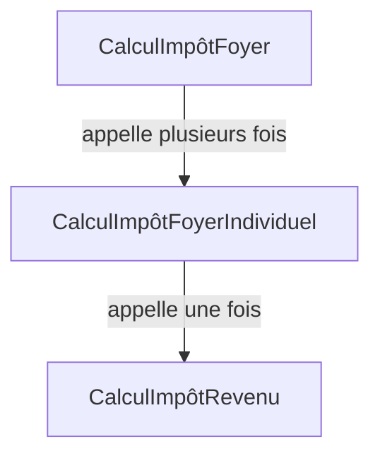

# Listes et champs d'application

<div id="tocw"></div>

Dans cette section, le tutoriel aborde un schéma courant qui augmente
considérablement la complexité d'une base de code : la nécessité de gérer des listes et des règles
s'appliquant à chaque élément de la liste. Ici, nous apprenons comment effectuer des opérations
avec des listes et déclarer un nouveau champ d'application pour traiter les règles s'appliquant à chaque élément
de la liste.

Les deux dernières sections du tutoriel sont assez difficiles et impliquent une certaine
complexité dans l'exemple. Cette complexité est nécessaire pour illustrer comment les
fonctionnalités de Catala s'adaptent aux textes juridiques du monde réel qui impliquent des fonctionnalités
complexes. Nous encourageons le lecteur à persévérer dans son étude de ces sections,
et à poser toute question sur le [chat en ligne de la communauté Catala](https://zulip.catala-lang.org).

~~~~~~admonish info collapsible=true title="Récapitulatif de la section précédente"
Cette section du tutoriel s'appuie sur la [précédente](./2-2-conditionals-exceptions.md),
et réutilisera le même exemple fil rouge, mais tout le code Catala nécessaire
pour exécuter l'exemple est inclus ci-dessous pour référence.

~~~catala-fr
{{#include ../../examples/tutoriel_fin_2_2.catala_fr}}
~~~
~~~~~~

## Créer un foyer à partir d'une liste d'individus

Précédemment, le Code des Impôts du Tutoriel Catala (CITC) a défini un impôt sur le revenu pour
chaque individu et ses enfants. Mais maintenant, le CITC devient plus gourmand car une
nouvelle taxe distincte similaire à la tristement célèbre [poll tax](https://fr.wikipedia.org/wiki/Poll_tax)
de Thatcher est introduite. À sa création,
l'impôt sur le foyer est tel que chaque individu d'un foyer est taxé d'une somme fixe,
avec un taux réduit pour les enfants :

~~~admonish quote title="Article 7"
Lorsque plusieurs individus vivent ensemble, ils sont collectivement soumis à
l'impôt sur le foyer. L'impôt sur le foyer dû est de 10 000 € par individu du foyer,
et la moitié de ce montant par enfant.
~~~

Maintenant, implémenter cela en Catala nécessite d'aller au-delà du
champ d'application `CalculImpôtRevenu` que nous avons utilisé plus tôt. En effet, cette nouvelle taxe nécessite
un nouveau champ d'application, `CalculImpôtFoyer` ! Bien qu'il soit assez évident que le
`résultat` de ce nouveau champ d'application devrait être `impôt_foyer`, son `entrée` est la
collection d'individus qui composent le foyer.

Heureusement, Catala possède un type intégré pour les collections de choses, appelé `liste`,
même s'il se comporte plus comme un tableau dans le jargon informatique traditionnel.

~~~admonish note title="Déclarer un nouveau champ d'application avec une entrée liste"
```catala-code-fr
déclaration champ d'application CalculImpôtFoyer:
  # La syntaxe "liste de <X>" désigne le type dont les valeurs sont des listes d'
  # éléments de type <X>.
  entrée individus contenu liste de Individu
  résultat impôt_foyer contenu argent
```
~~~

Pour définir `impôt_foyer`, nous devons maintenant :
1. compter le nombre d'individus dans `individus` ;
2. compter le nombre d'enfants de chaque individu et additionner ces comptes ;
3. multiplier ces comptes par le bon montant d'impôt.

Nous effectuerons chacune de ces étapes dans le corps de la `définition` de
`impôt_foyer`, dans le champ d'application `CalculImpôtFoyer`, en utilisant des variables
locales.

~~~admonish tip title="Variables de champ d'application `interne` et variables locales dans les définitions"
Lorsqu'une définition de variable devient complexe comme ci-dessus, il est souvent utile de
séparer chaque étape en définissant des variables intermédiaires. Il y a deux façons
de faire cela.

Premièrement, vous pouvez déclarer à l'intérieur de la déclaration du champ d'application une variable de champ d'application supplémentaire
avec l'étiquette `interne` au lieu de `entrée` ou `résultat`, comme vu dans
la [première section du tutoriel](./2-1-basic-blocks.md).

Deuxièmement, si vous êtes sûr que vous n'aurez besoin de la variable intermédiaire
que dans le contexte étroit d'une seule définition de variable de champ d'application, vous pouvez utiliser une
variable locale à l'intérieur de la définition de la variable de champ d'application. Ces variables locales
sont introduites et utilisées avec la syntaxe suivante :

```catala-expr-fr
# La ligne suivante définit la variable locale "x" comme étant égale à 4 * 5
soit x égal à 4 * 5 dans
# Nous pouvons ensuite utiliser "x" après le mot-clé "dans" dans le reste du code
x + 2
```
~~~

Pour l'étape 1, nous avons simplement besoin d'obtenir la longueur de la liste `individus`, ce qui
peut être fait via la syntaxe `nombre de individus` (la syntaxe pour toutes les opérations
sur les listes peut être trouvée dans [l'aide-mémoire de la syntaxe](https://catalalang.github.io/catala/syntax.pdf)
ou dans le [guide de référence](./5-catala.md)). Pour l'étape 2, nous
devons agréger le nombre d'enfants pour tous les individus, ce qui peut être fait
via la syntaxe `somme entier de transforme chaque individu
parmi individus en individu.nombre_enfants`. Notez l'indication de type (`entier`) pour la `somme`, qui
indique que si la liste des individus est vide, alors l'entier `0` doit
être renvoyé. Enfin, nous pouvons assembler les étapes 1 et 2 pour l'étape 3 qui calcule
le montant de l'impôt :

~~~admonish note title="Calculer la longueur d'une liste et agréger des montants"
```catala-code-fr
champ d'application CalculImpôtFoyer:
  définition impôt_foyer égal à
    soit nombre_individus égal à nombre de individus dans
    soit nombre_enfants égal à
      somme entier de
        transforme chaque individu parmi individus en individu.nombre_enfants
    dans
    10 000 €
    * (
      # "nombre_individus" est un entier, mais le résultat de la division
      # est un décimal, et nous ne pouvons pas ajouter un entier et un décimal sans d'abord
      # convertir l'un d'eux
      décimal de nombre_individus + nombre_enfants / 2
    )
```
~~~

Cette implémentation de l'article 7 est assez directe et concise. Elle fonctionne,
mais notez un décalage subtil entre le texte de l'article 7 et son implémentation
Catala : plutôt que d'agréger séparément la contribution de chaque
individu et de ses enfants à l'impôt sur le foyer, nous comptons tous les individus
d'un côté, et tous les enfants de l'autre. L'addition est commutative
et associative donc ce décalage donne le même résultat. Cependant, ne pas suivre
l'esprit de la loi dans l'implémentation pourrait ne pas être pérenne, comme nous le
verrons juste en dessous...


~~~admonish success title="Tester l'impôt sur le foyer"
Pour tester ce qui se passe lorsque la règle de l'article 7 est en jeu,
vous pouvez tester le programme avec un foyer :

```catala-code-fr
déclaration champ d'application TestFoyer:
  résultat calcul contenu CalculImpôtFoyer

champ d'application TestFoyer:
  définition calcul égal à
    résultat de CalculImpôtFoyer avec {
      -- individus:
        # Le champ d'application attend une liste d'individus. En Catala, une liste est construite
        # avec la syntaxe "[<élément 1>; <élément 2>; ...]".
        [ Individu {
            -- revenu: 15 000 €
            -- nombre_enfants: 0
          } ;
          Individu {
            -- revenu: 80 000 €
            -- nombre_enfants: 2
          } ]
    }
```

Le résultat de l'exécution est alors :

```console
$ clerk run tutoriel.catala_fr --scope=TestFoyer
┌─[RESULT]─
│ calcul = CalculImpôtFoyer { -- impôt_foyer: 30 000,00 € }
└─
```

Nous avons deux individus et deux enfants donc 2 x 10 000 € + 2 x 5 000 € = 30 000 €.
~~~

## Refactoriser pour tenir compte de l'évolution des exigences

Traduire des textes juridiques en code exécutable est souvent des montagnes russes émotionnelles,
car de nouvelles exigences dans des articles ultérieurs peuvent complètement briser les invariants et
la structure de l'implémentation que vous avez utilisée dans les articles précédents. Aujourd'hui, le
Code des Impôts du Tutoriel Catala (CITC) sera dur avec nous, avec l'article fatidique
suivant :

~~~admonish quote title="Article 8"
Le montant de l'impôt sur le revenu payé par chaque individu peut être déduit de la
part de l'impôt sur le foyer due par cet individu.
~~~

Maintenant, il existe plusieurs stratégies pour implémenter l'article 8, mais toutes ne sont pas
juridiquement correctes. Une stratégie pourrait être de calculer le montant total de l'impôt sur le revenu
dû par tous les individus du foyer, et de soustraire ce montant total d'
impôt sur le revenu du montant total de l'impôt sur le foyer pour effectuer la déduction.
Cependant, cette stratégie est incorrecte, car la déduction de l'impôt sur le foyer pour un
individu est implicitement plafonnée par le montant de l'impôt sur le foyer dû pour cet
individu ! Ce plafonnement introduit une non-linéarité dans la formule qui empêche
de réorganiser les additions et les soustractions tout en gardant les mêmes résultats dans
toutes les configurations.

~~~admonish danger title="Attention à la non-linéarité de l'article 8 !"
Supposons que vous ayez deux individus, `A` et `B`, sans enfants, dans un foyer
qui n'est pas situé dans un territoire d'outre-mer, avant l'an 2000.

Supposons aussi que le revenu de `A` est de 20 000 €, tandis que le revenu de `B` est de 200 000 €.
Selon les articles 1 à 6, `A` paiera 20 000 € x 20% = 4 000 € d'impôt sur le
revenu, tandis que `B` paiera 200 000 € x 30% = 60 000 €. Donc, au total, le foyer
paie 64 000 € d'impôt sur le revenu.

D'autre part, l'impôt sur le foyer dû par ce foyer est de
10 000 € + 10 000 € = 20 000 €. Comment appliquer l'article 8 dans cette situation ?
Soustraire naïvement l'impôt sur le revenu total (64 000 €) de l'impôt sur le foyer
total (20 000 €) donne un impôt sur le foyer révisé de 0 €, mais ce n'est pas le montant
légal. En effet, la déduction ne peut avoir lieu qu'au niveau individuel.

`A` peut déduire 4 000 € de sa part de 10 000 € d'impôt sur le foyer, donc il doit
6 000 € d'impôt sur le foyer. Mais `B` ne peut déduire que 10 000 € de sa part de 10 000 €
d'impôt sur le foyer, le laissant avec 0 € d'impôt sur le foyer à payer, mais
pas -50 000 € ! C'est la non-linéarité en action.

Donc au total, le montant total correct d'impôt sur le foyer à payer ici est de
6 000 € et non 0 € comme la méthode de soustraction globale l'a calculé.
~~~

Nous sommes donc contraints de décomposer explicitement le calcul de l'impôt sur le foyer en
deux étapes : d'abord, calculer la part de l'impôt sur le foyer due par chaque individu,
puis agréger le résultat de la première étape pour tous les individus du
foyer. Naturellement, le champ d'application existant `CalculImpôtFoyer` est l'endroit où la
deuxième étape aura lieu. Mais où mettre la première étape ? Une refactorisation est nécessaire !

~~~admonish question title="Est-il acceptable de refactoriser du code antérieur lors du codage d'un nouvel article ?"
Oui !

Théoriquement, comme Catala vous permet de structurer le code en faisant correspondre la
structure du texte juridique, l'ajout de nouveaux articles ne devrait pas nécessiter de changements
dans les blocs de code antérieurs. C'est le cas par exemple lorsqu'un nouvel article
définit une exception au cas de base d'une variable, comme nous l'avons expérimenté dans
la [deuxième section du tutoriel](./2-2-conditionals-exceptions.md).

Mais l'ajout d'exceptions n'est pas la seule chose que les nouveaux articles peuvent introduire.
Dans ce cas, nous voyons que l'article 8 rend explicite une étape de calcul
qui était implicite ou cachée dans l'article 7 (à savoir, le calcul de la
part de l'impôt sur le foyer pour chaque individu). Rendre cette étape de calcul explicite
implique de lui donner un statut de premier ordre avec un concept Catala (une variable,
un champ d'application, etc.), ce qui n'était peut-être pas le cas dans le code Catala écrit auparavant.
Par conséquent, il est normal de refactoriser le code antérieur pour coder le nouvel article 8.

Cependant, le but de la refactorisation est toujours de faire correspondre aussi précisément que
possible les étapes de calcul et les articles sur lesquels elles sont basées.
~~~

Comme cela s'est déjà produit pour l'article 8, les articles suivants sont susceptibles
d'introduire des raffinements et des exceptions pour cette part de l'impôt sur le foyer. Dans
ce cas, il est préférable d'utiliser un champ d'application à part entière pour représenter cette étape de
calcul supplémentaire. Le champ d'application est lisible par les juristes et possède des fonctionnalités
pratiques pour ajouter des paramètres d'entrée et de sortie, définir des exceptions pour ses variables locales, etc.

Par conséquent, nous opterons pour la création d'un tout nouveau champ d'application pour calculer la part de
l'impôt sur le foyer due par un individu, `CalculImpôtFoyerIndividuel`.

## Le champ d'application manquant : calcul de l'impôt sur le foyer pour l'individu

Le nouveau champ d'application, `CalculImpôtFoyerIndividuel`, aura comme entrée un
individu et renverra comme résultat le montant de l'impôt sur le foyer détenu. Cependant,
à cause de l'article 8, le champ d'application devra également calculer le montant de l'impôt sur le
revenu dû par l'individu, pour le déduire de l'impôt sur le foyer. Le graphe d'appel
entre les champs d'application sera alors le suivant :




Par conséquent, nous aurons également besoin comme entrée de `CalculImpôtFoyerIndividuel` des
entrées nécessaires pour le champ d'application `CalculImpôtRevenu` de la [section précédente
du tutoriel](./2-2-conditionals-exceptions.md) : `territoires_outre_mer` et
`date_courante`. Cela donne la déclaration de champ d'application suivante :

~~~admonish quote title="Déclaration initiale de `CalculImpôtFoyerIndividuel`"
```catala-code-fr
déclaration champ d'application CalculImpôtFoyerIndividuel:
  entrée individu contenu Individu
  entrée territoires_outre_mer contenu booléen
  entrée date_courante contenu date

  résultat impôt_foyer contenu argent
```
~~~

Maintenant, nous savons que nous devrons appeler `CalculImpôtRevenu` exactement une fois pour
calculer la déduction pour `impôt_foyer`. Il existe une méthode sur mesure conçue
pour la lisibilité par les juristes pour faire exactement cela en Catala !

~~~admonish note title="Déclarer un appel de sous-champ d'application statique et définir les entrées de l'appel de sous-champ d'application"
```catala-code-fr
# L'appel unique et statique au sous-champ d'application "CalculImpôtRevenu" doit être
# déclaré dans "CalculImpôtFoyerIndividuel", nous répétons donc la
# déclaration du champ d'application ici avec une nouvelle ligne.
déclaration champ d'application CalculImpôtFoyerIndividuel:
  entrée individu contenu Individu
  entrée territoires_outre_mer contenu booléen
  entrée date_courante contenu date

  # La ligne suivante déclare un appel statique et unique au sous-champ d'application
  # "CalculImpôtRevenu" avec le nom "calcul_impôt_revenu".
  calcul_impôt_revenu champ d'application CalculImpôtRevenu

  résultat impôt_foyer contenu argent

champ d'application CalculImpôtFoyerIndividuel:
  # À l'intérieur d'un bloc "champ d'application", nous devons définir les arguments de l'appel au sous-champ d'application
  # "calcul_impôt_revenu" : "individu", "territoires_outre_mer" et
  # "territoires_outre_mer".
  définition calcul_impôt_revenu.individu égal à
    individu
  # L'"individu" donné comme argument à "calcul_impôt_revenu",
  # qui est l'appel à "CalculImpôtRevenu", est le même "individu"
  # qui est l'entrée de "CalculImpôtFoyerIndividuel".
  définition calcul_impôt_revenu.territoires_outre_mer égal à
    territoires_outre_mer
  # Ces lignes peuvent sembler tautologiques mais elles sont essentielles pour connecter
  # les champs d'application aux sous-champs d'application de manière non ambiguë. Il est implicite que nous évaluons
  # l'impôt sur le revenu pour la déduction à la même date que nous évaluons le montant de
  # l'impôt sur le foyer, mais cette ligne le rend explicite. Parfois, vous pourriez vouloir
  # appeler le calcul de l'impôt sur le revenu à une date antérieure (comme "date_courante
  # - 5 an") en raison d'une exigence légale, et c'est là que vous spécifiez
  # cela !
  définition calcul_impôt_revenu.date_courante égal à
    date_courante
```

C'est tout, l'appel au sous-champ d'application a été complètement configuré ! Le résultat
est maintenant accessible à `calcul_impôt_revenu.impôt_revenu`, puisque
"impôt_revenu" est la variable de résultat du sous-champ d'application `CalculImpôtRevenu`.
~~~

À ce stade, il est facile de définir `impôt_foyer` en un seul passage
à l'intérieur de `CalculImpôtFoyerIndividuel` :

```catala-code-fr
champ d'application CalculImpôtFoyerIndividuel:
  définition impôt_foyer égal à
    soit impôt égal à
      10 000 € * (1,0 + individu.nombre_enfants / 2)
    dans
    soit déduction égal à calcul_impôt_revenu.impôt_revenu dans
    # N'oubliez pas de plafonner la déduction !
    si déduction > impôt alors 0 € sinon impôt - déduction
```

~~~admonish success title="Tester l'impôt sur le foyer individuel"
Pour tester ce qui se passe lorsque la règle des articles 7 et 8 est en jeu
vous pouvez tester le programme avec un individu :

```catala-code-fr
déclaration champ d'application TestFoyerIndividuel:
  résultat calcul contenu CalculImpôtFoyerIndividuel

champ d'application TestFoyerIndividuel:
  définition calcul égal à
    résultat de CalculImpôtFoyerIndividuel avec {
      -- individu:
        Individu {
          -- revenu: 15 000 €
          -- nombre_enfants: 0
        }
      -- date_courante: |1999-01-01|
      -- territoires_outre_mer: faux
    }
```

Le résultat de l'exécution est alors :

```test
$ clerk run tutoriel.catala_fr --scope=TestFoyerIndividuel
┌─[RESULT]─
│ calcul = CalculImpôtFoyerIndividuel { -- impôt_foyer: 7 000,00 € }
└─
```

L'impôt sur le foyer dû par un individu sans enfants est de 10 000 €, mais
nous devons déduire son impôt sur le revenu. Avec un revenu de 15 000 €, avant 2000 et
pas dans un territoire d'outre-mer, le taux d'impôt sur le revenu est de 20% selon l'article 2,
donc 3 000 € d'impôt sur le revenu. Par conséquent, l'impôt sur le foyer correct dû avec
déduction est de 7 000 €.
~~~

## Conclusion

Dans cette section du tutoriel, nous avons vu qu'en Catala, les listes d'éléments
sont représentées comme des valeurs avec leur propre type comme `liste de argent` ou
`liste de Individu`. Vous pouvez manipuler des listes avec des opérateurs
comme longueur, comptage, agrégation, mais aussi transformer, filtrer, etc. Veuillez vous référer
au [guide de référence](./5-catala.md) pour des informations sur tous les
opérateurs de liste disponibles en Catala. De plus, nous avons également vu dans
cette section du tutoriel que plutôt que d'programmer toutes les règles pour traiter
les éléments dans les listes à l'intérieur des opérateurs de liste, il est préférable de créer
un nouveau champ d'application pour écrire toutes les règles qui s'appliquent aux éléments de la liste. Cela nous a
permis de voir comment les champs d'application peuvent s'appeler les uns les autres et permettre une base de code
modulaire qui peut être refactorisée pour tenir compte de l'évolution des exigences légales.

Cependant, pour l'instant, notre implémentation des articles 7 et 8 n'est pas complète, car
il nous manque l'étape où `CalculImpôtFoyer` appelle
`CalculImpôtFoyerIndividuel` sur chaque individu du foyer pour
compléter le calcul de l'impôt sur le foyer avec la déduction correcte. Ce sera
le sujet de la [prochaine et dernière section du
tutoriel](./2-4-states-dynamic.md).

~~~~~~admonish info collapsible=true title="Récapitulatif de la section actuelle"
Pour référence, voici la version finale du code Catala consolidé à la fin de
cette section du tutoriel.

~~~catala-fr
{{#include ../../examples/tutoriel_fin_2_3.catala_fr}}
~~~
~~~~~~
