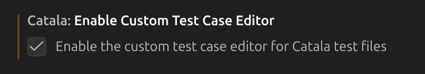
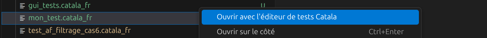
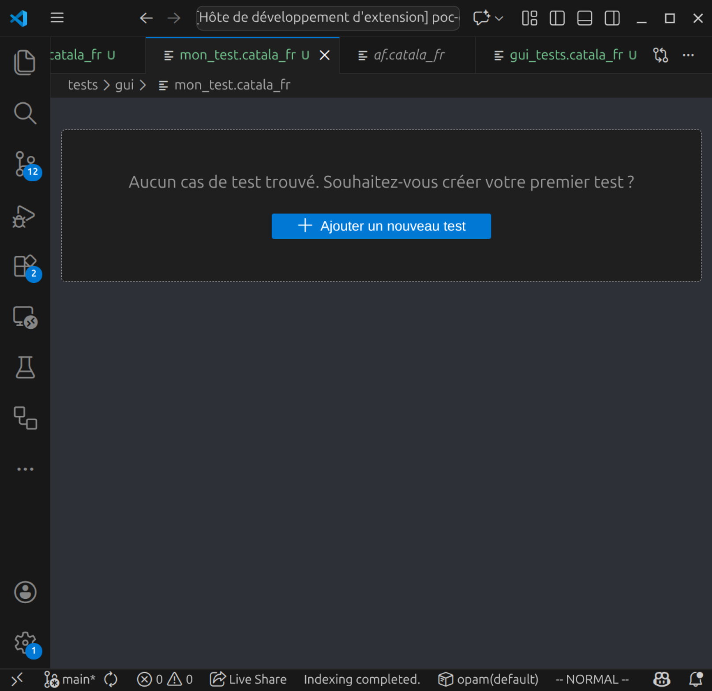
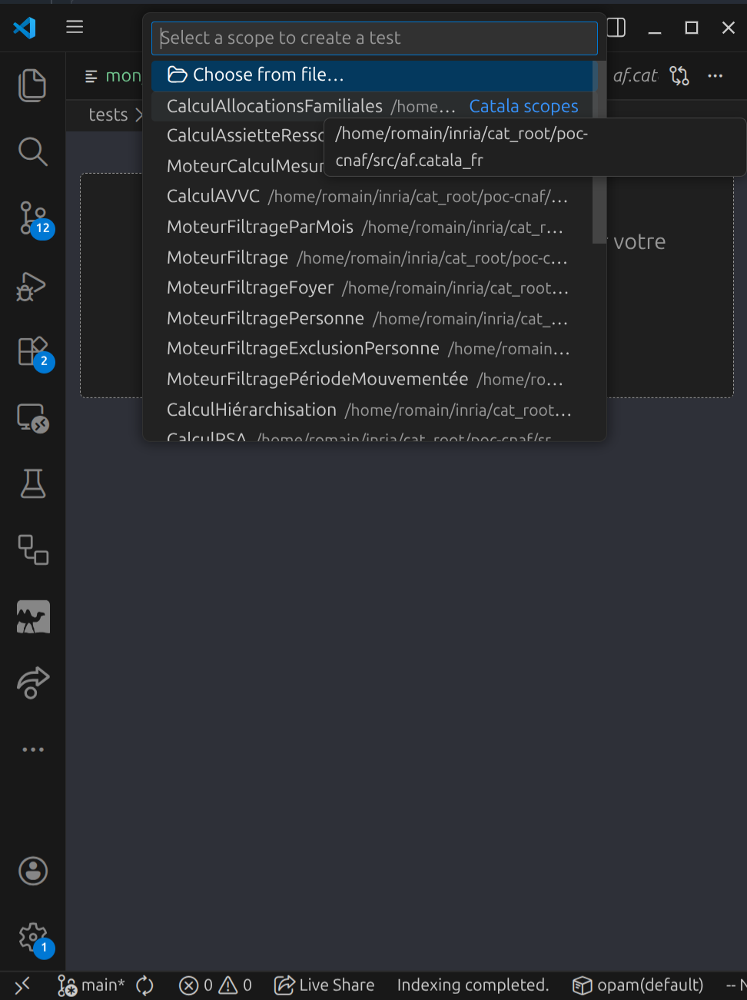
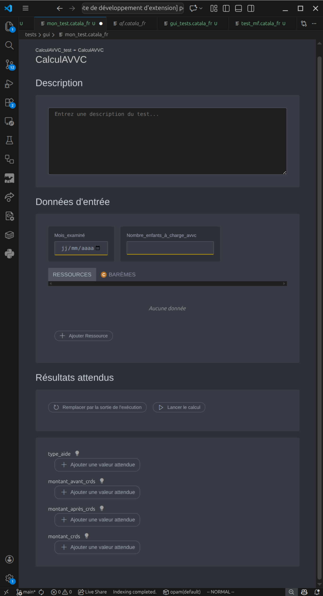
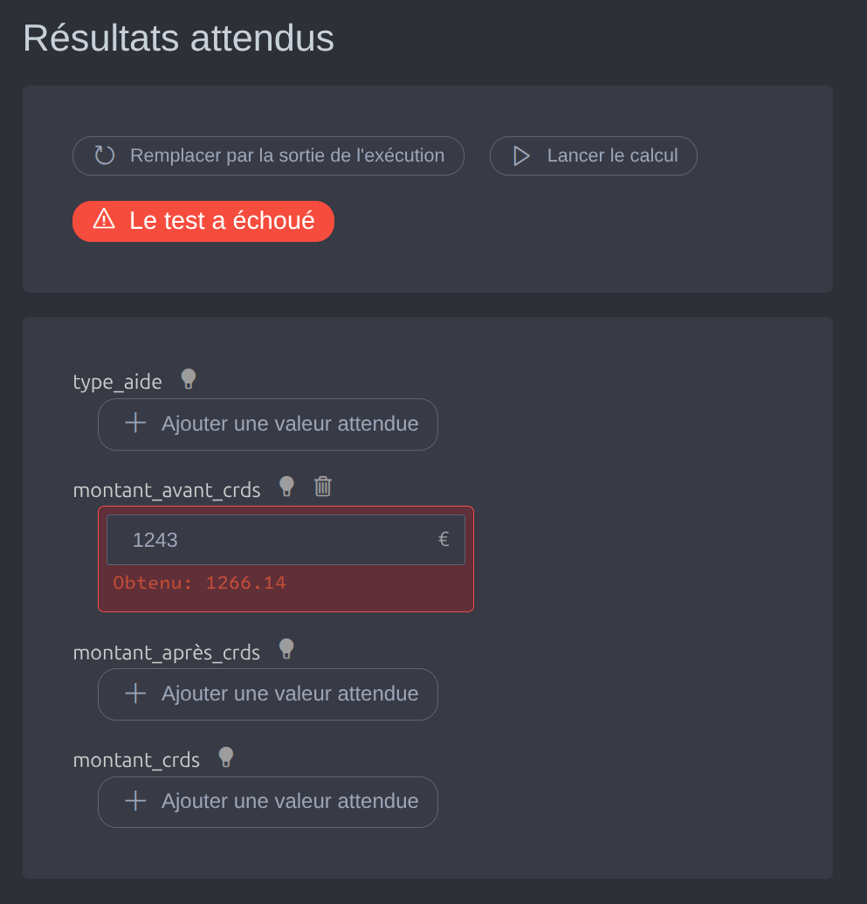
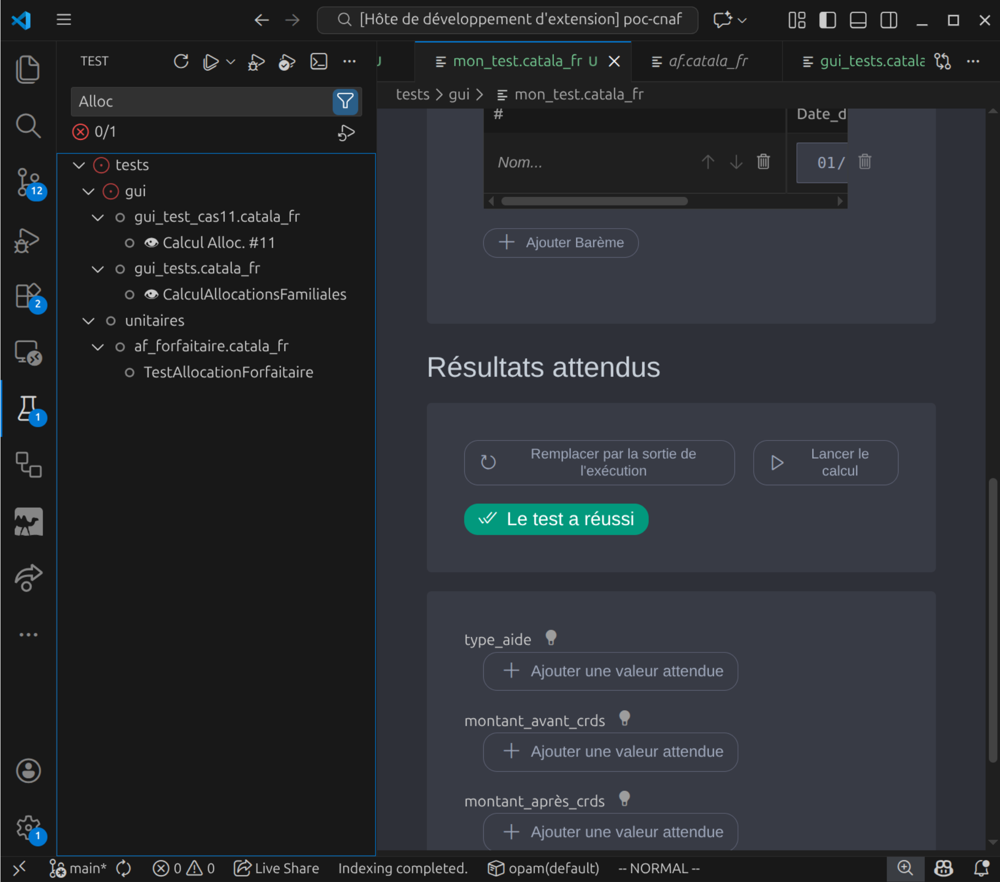
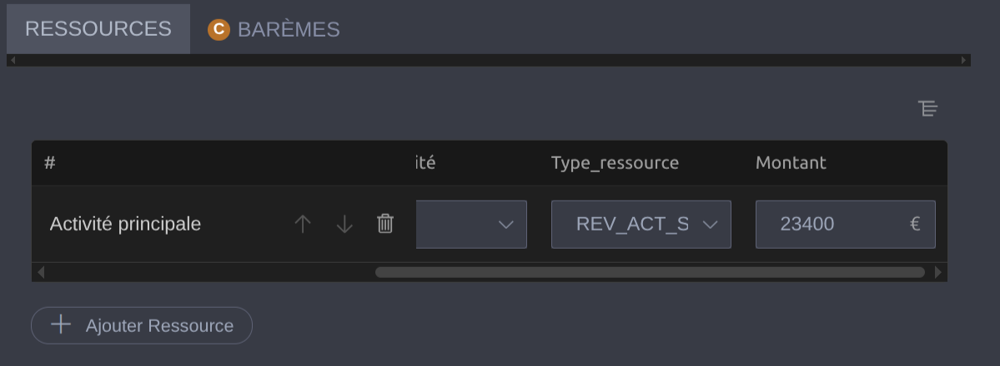

# Éditeur de cas de test

Le plugin Catala pour VSCode fournit une interface graphique (GUI) pour aider à créer et gérer des tests de bout en bout. Contrairement aux tests unitaires qui se concentrent sur des unités atomiques d'implémentation, les tests de bout en bout visent à tester la sortie d'un calcul complet, ou à reproduire des calculs erronés trouvés en production pour détecter des régressions. Ces tests sont souvent écrits par des experts du domaine qui peuvent ou non être des développeurs.

~~~admonish info title="Quels tests peuvent être gérés par l'éditeur de cas de test ?"
Les tests Catala sont généralement écrits dans des fichiers de code source Catala, comme expliqué dans le [guide de test](./3-3-0-test-ci.md). Cependant, ces cas de test Catala ordinaires écrits par des programmeurs sont généralement incompatibles avec l'éditeur de cas de test présenté sur cette page. Les tests gérés par l'éditeur de test doivent être créés à l'intérieur de l'outil lui-même et vivre séparément des autres tests écrits sous forme de fichiers de code source Catala ordinaires.
~~~

## Activation de l'éditeur de cas de test

L'éditeur de cas de test doit être activé avant la première utilisation.

Pour ce faire, ouvrez le panneau de commande de VS Code (ctrl-shift-P) et recherchez "paramètres", puis filtrez en tapant "catala" dans la zone de recherche.

Dans les paramètres Catala, cochez "Enable the custom test editor for Catala test files".

## Création d'un test géré par l'éditeur de cas de test

Pour créer un test qui peut être géré par l'éditeur de cas de test, créez un nouveau fichier source (se terminant par `.catala_fr`) et assurez-vous que son nom contient "test" (par exemple `test_impôt_sur_le_revenu_42.catala_fr`). Cliquez avec le bouton droit sur le fichier nouvellement créé et sélectionnez "Ouvrir avec l'éditeur de test Catala".

~~~admonish warning title="Les noms de fichiers de test doivent contenir `test`"
Pour éviter que VSCode ait besoin de jeter un œil au contenu des fichiers avant de décider quel(s) plugin(s) peuvent les ouvrir, le plugin de cas de test est restreint à l'ouverture de fichiers Catala contenant `test` dans leur nom. D'autres fichiers déclencheront l'éditeur de texte usuel.
~~~

Ouvrir ce nouveau test dans l'éditeur de test affichera une page d'accueil qui vous permet de créer un nouveau test.

### Sélectionner un champ d'application

Les champs d'application disponibles dans le projet sont détectés automatiquement et listés dans une boîte de dialogue.

Sélectionnez celui que vous souhaitez tester, et un formulaire d'entrée sera affiché.

~~~admonish warning title="Les champs d'application testés **doivent** être définis dans un module"
Bien que tout le code Catala n'ait pas besoin de vivre dans un module, tous les champs d'application exercés à l'aide de l'outil de test **doivent** être définis dans un module.
~~~

### Définir les données d'entrée et les valeurs attendues

Signaler les différences entre les sorties attendues et les résultats du calcul réel est la fonction essentielle d'un test.

La section Résultats attendus de l'éditeur vous permet de les définir.

## Exécution d'un test / vue diff

Exécutez un test en utilisant le bouton "Exécuter le test", ou directement via le runner de test dans VS Code. Les tests gérés par l'éditeur de cas de test sont des tests Catala complets et peuvent (en fait, devraient !) également être exécutés en utilisant `clerk run` et faire partie de la suite de tests exercée par `clerk test`.

Lorsqu'un test échoue, l'éditeur de cas de test tentera d'afficher un diff structurel, y compris les éléments de tableau manquants ou supplémentaires.

## Gestion d'une base de code de test avec l'éditeur de cas de test et VSCode

~~~admonish tip title="Dois-je inclure les tests créés avec l'éditeur de cas de test dans le système de contrôle de version et les exécuter dans mon système d'intégration continue ?"
**Oui !** Bien que nous fournissions une interface graphique pour que les non-programmeurs créent des tests métier sans écrire de littéraux et d'assertions Catala, les bonnes pratiques d'ingénierie logicielle sont inchangées. Les tests sont stockés sous forme de fichiers Catala simples (avec quelques attributs techniques) pour aider à les vérifier et à examiner les diffs de la même manière que d'autres fichiers de test et de programme.
~~~

### Recherche de tests

Les tests gérés par l'éditeur de cas de test sont visibles en tant que tests natifs dans la vue de test de VS Code (icône de bécher dans le menu principal) et peuvent être recherchés par nom ou champ d'application cible (comme les tests usuels).

### Métadonnées

Lors de tests de données profondément imbriquées, il est souvent souhaitable de nommer les éléments de test pour référence (par exemple, un membre d'un foyer,
une activité...). Cela peut être fait dans l'éditeur de tableau.

Lorsque des éléments nommés ont des sous-éléments, ceux-ci référenceront le nom de leur parent pour une navigation rapide.

Une description et un titre de test peuvent également être fournis.
